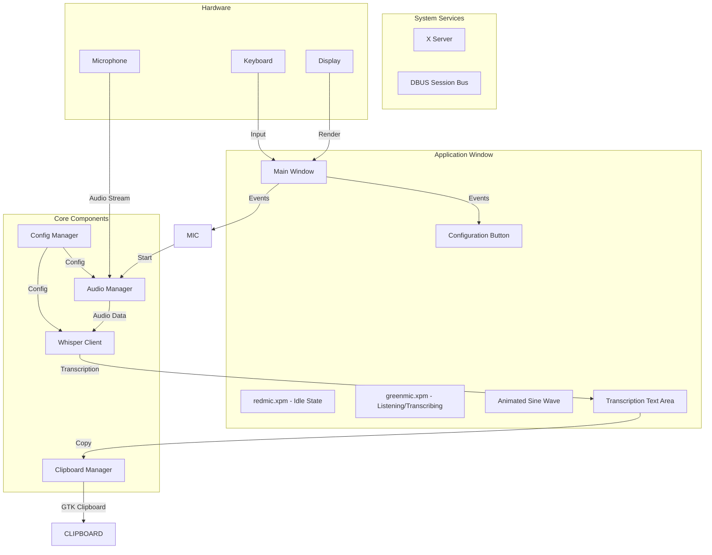
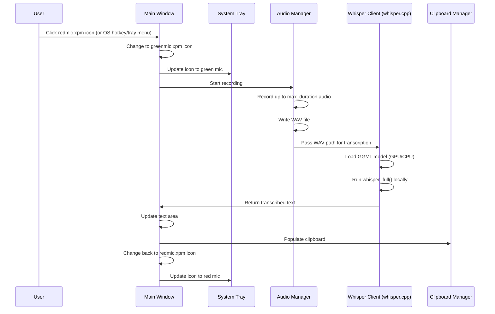

# Software Requirements Specification (SRS)
## X-Windows Voice-to-Text Application

**Document Version:** 2.1
**Date:** 2026-05-25
**Author:** System Architecture Team
**Status:** Production-Ready

### Revision History

| Version | Date | Changes |
|---------|------|---------|
| 2.1 | 2026-05-25 | Added requirements for: Volume Level Monitoring (FR-051, UI-028, AUD-016), Audio Device Display Name (CFG-AUDIO-002), Loading State Indicator (UI-023), Transcription Watchdog (NR-019 updated), Model Loading Background Thread (WHISPER-014), GPU Discovery Module (FR-049d), enhanced Model Metadata Extraction (WHISPER-013) |
| 2.0 | 2026-05-25 | Major update: Replaced VLLM server with local whisper.cpp, added System Tray Icon, added GPU (CUDA) support, added Model Info module, updated configuration parameters |
| 1.0 | 2026-05-17 | Initial SRS with VLLM server integration |

---

## Table of Contents

1. [Introduction](#1-introduction)
2. [System Architecture](#2-system-architecture)
3. [Functional Requirements](#3-functional-requirements)
4. [Non-Functional Requirements](#4-non-functional-requirements)
5. [Audio Capture Pipeline](#5-audio-capture-pipeline)
6. [Local Whisper Integration (whisper.cpp)](#6-local-whisper-integration-whispercpp)
7. [X-Windows UI Components](#7-x-windows-ui-components)
8. [Hotkey Integration](#8-hotkey-integration)
9. [Configuration Management](#9-configuration-management)
10. [Error Handling and Fallbacks](#10-error-handling-and-fallbacks)
11. [Dependency Specifications](#11-dependency-specifications)
12. [Deployment and Startup Procedures](#12-deployment-and-startup-procedures)
13. [Testing and Validation Criteria](#13-testing-and-validation-criteria)
14. [Appendix](#14-appendix)

---

## 1. Introduction

### 1.1 Purpose

This document specifies the Software Requirements Specification (SRS) for a GTK3-based voice-to-text application. The application provides a graphical interface with a microphone icon that, when clicked, captures audio from a configured microphone (system default or user-selected), transcribes it using a local Whisper model via the whisper.cpp library (fully offline, no network required), and displays the transcribed text in a persistent, lightweight text area attached to the application window. The text area allows users to view, edit, and copy the transcribed text to the system clipboard for use in other applications.

### 1.2 Scope

The X-Windows voice-to-text application provides:
- Normal application window with redmic.xpm icon as initial presentation (mic not listening)
- System tray icon (notification area) via libappindicator with state-aware icon and context menu
- Click-to-start listening functionality, changing to greenmic.xpm icon
- Animated sine wave visualization over the microphone icon during recording
- Persistent, lightweight text area attached to the application window for displaying transcribed text
- Configurable maximum transcription sessions (default: 30 seconds, range: 5-30) with user-initiated stop capability
- Local Whisper model integration via whisper.cpp (fully offline, no network required)
- GPU (CUDA) acceleration support with automatic CPU fallback
- GGML model file management with metadata extraction (model name, quantization, multilingual support)
- System clipboard integration (via GTK3) for copied text that can be pasted into other applications
- Configuration UI for model path, microphone selection, and more
- Manual stop with final transcription of remaining audio
- In-place editing of transcribed text before copying
- Automatic return to redmic.xpm icon after transcription completes or session ends
- Global hotkey support via OS or window manager for toggling recording without clicking the window

### 1.3 Definitions

| Term | Definition |
|------|------------|
| SRS | Software Requirements Specification |
| GTK3 | GTK+ 3 — GIMP Toolkit version 3, cross-platform GUI toolkit |
| Whisper | OpenAI's speech-to-text model |
| whisper.cpp | Local, offline C/C++ implementation of Whisper inference (ggml-org/whisper.cpp) |
| GGML | Tensor library with machine learning primitives used by whisper.cpp for model storage and inference |
| GPU (CUDA) | NVIDIA GPU acceleration via CUDA backend in whisper.cpp, with automatic CPU fallback |
| WAV | Waveform Audio File Format |
| Text Area | Lightweight, persistent text display window attached to the application window that displays transcribed text, allows in-place editing, and supports copying to the system clipboard |
| Clipboard | System clipboard (PRIMARY and CLIPBOARD selections on X11, primary clipboard on Wayland) managed via GTK3 clipboard APIs |
| Hotkey | A global keyboard shortcut configured in the OS or window manager that triggers a command or action in the application |
| D-Bus | Desktop Bus — an inter-process communication system used on Linux desktops |
| System Tray | Notification area icon provided via libappindicator (Ayatana fork) with state-aware icon and context menu |

### 1.4 Document Conventions

- **FR-XXX**: Functional Requirement
- **NR-XXX**: Non-Functional Requirement
- **AUD-XXX**: Audio Pipeline Requirement
- **WHISPER-XXX**: Whisper API Requirement
- **UI-XXX**: UI Component Requirement
- **HK-XXX**: Hotkey Requirement
- **CFG-XXX**: Configuration Requirement
- **ERR-XXX**: Error Handling Requirement
- **DEP-XXX**: Dependency Requirement
- **DEPLOY-XXX**: Deployment Requirement
- **TEST-XXX**: Testing Requirement

### 1.5 Overview

This document is organized by functional areas:
- Section 2: System Architecture
- Section 3: Functional Requirements
- Section 4: Non-Functional Requirements
- Section 5: Audio Capture Pipeline
- Section 6: Whisper API Integration
- Section 7: X-Windows UI Components
- Section 8: Hotkey Integration
- Section 9: Configuration Management
- Section 10: Error Handling
- Section 11: Dependencies
- Section 12: Deployment
- Section 13: Testing
- Section 14: Appendix

The application supports global hotkey activation for starting and stopping transcription, triggered by the operating system or desktop environment. The hotkey is configured externally (not within the application) via desktop environment tools. The application exposes a D-Bus method for toggling transcription, which the OS hotkey action can invoke via `dbus-send`.

---

## 2. System Architecture

### 2.1 Threading Model

The application is built on a multi-threaded architecture managed by a **Central State Controller** that coordinates all state transitions and inter-thread communication. Three distinct threads operate concurrently:

| Thread | Responsibility | Key Operations |
|--------|---------------|----------------|
| **Presentation Thread (Main)** | GTK main loop, UI rendering, D-Bus IPC | GTK main loop (`gtk_main()`), window management (GTK handles WM hints automatically), rendering (GdkPixbuf icons, Cairo drawing for sine wave animation), D-Bus IPC polling via `g_unix_fd_add()` on the D-Bus file descriptor integrated into the GTK main loop, system tray icon updates via libappindicator |
| **Audio Thread** | Real-time PCM capture | Captures audio from ALSA using real-time priority scheduling. Writes raw PCM frames to a temporary WAV file. Suspended in `STATE_IDLE`, active in `STATE_LISTENING`. |
| **Transcription Thread** | Local whisper.cpp model processing | Loads GGML model file, reads WAV samples, runs `whisper_full()` for local transcription. Supports GPU (CUDA) acceleration with CPU fallback. Active only in `STATE_TRANSCRIBING`. |

**Design Rationale:**
- The Audio Thread runs independently to guarantee real-time capture without being blocked by GTK rendering or transcription processing.
- The Transcription Thread isolates blocking whisper.cpp model processing from the Presentation Thread, preventing UI freezes during local transcription.
- The Presentation Thread concurrently polls the D-Bus file descriptor using `g_unix_fd_add()`, enabling responsive hotkey toggling without a dedicated D-Bus thread.
- The Central State Controller ensures thread-safe state transitions using mutex-protected state variables.
- No network thread is required since all transcription is performed locally via whisper.cpp.

### 2.2 High-Level Component Diagram



### 2.3 Application State Machine

The Central State Controller manages a finite state machine with three distinct states. State transitions are thread-safe and coordinated across all three threads.

```
STATE_IDLE --> STATE_LISTENING --> STATE_TRANSCRIBING --> STATE_IDLE
```

**State Descriptions:**

- **`STATE_IDLE`**:
  - **Presentation Thread**: Main window displays `redmic.xpm`. Status bar indicator reflects local model availability (green/red). System tray icon shows red mic.
  - **Audio Thread**: Suspended. No audio capture active.
  - **Transcription Thread**: Idle.
  - **Entry Trigger**: Application launch, or completion of transcription cycle.

- **`STATE_LISTENING`**:
  - **Presentation Thread**: Main window displays `greenmic.xpm` with active sine wave overlay animation. System tray icon shows green mic with "Recording..." tooltip.
  - **Audio Thread**: Active. Capturing real-time PCM from ALSA, writing to temporary WAV file (created via `mkstemp()` in `$XDG_RUNTIME_DIR` or `/tmp/`).
  - **Transcription Thread**: Idle.
  - **Watchdog Timer**: A configurable watchdog timer (default: 30 seconds, range: 5-30 seconds) limits maximum capture duration. On timeout, automatic transition to `STATE_TRANSCRIBING`.
  - **Atomic Sequence Counter**: The Central State Controller must implement an atomic sequence counter or cancellation token for state transitions. When the user initiates a stop (manual or via hotkey), the watchdog timer must be cleanly invalidated before the WAV file handle is closed, preventing race conditions where both threads attempt to transition to `STATE_TRANSCRIBING` simultaneously.
  - **Entry Trigger**: Mouse click on microphone icon in `STATE_IDLE`, D-Bus `Toggle` method call, or system tray context menu "Toggle Recording".
  - **Exit Trigger**: User click to stop, D-Bus `Toggle` call, or watchdog timeout.

- **`STATE_TRANSCRIBING`**:
  - **Presentation Thread**: Main window displays `greenmic.xpm` (sine wave animation stopped). System tray icon shows green mic with "Transcribing..." tooltip.
  - **Audio Thread**: WAV file closed. No further writes.
  - **Transcription Thread**: Active. Loads GGML model (if not already loaded), reads WAV samples, runs `whisper_full()` for local transcription via whisper.cpp. Supports GPU (CUDA) acceleration with automatic CPU fallback.
  - **Post-Transcription Actions**:
    1. Transcribed text sent to `TextWindow` for display.
    2. Clipboard selections (PRIMARY and CLIPBOARD) populated with transcribed text via GTK3 clipboard APIs.
    3. Temporary WAV file unlinked and deleted.
    5. Raw PCM memory buffers freed prior to returning to `STATE_IDLE`.
    6. Reverts to `STATE_IDLE`.
  - **Entry Trigger**: Exit from `STATE_LISTENING` (user stop or watchdog timeout).

State transitions may be triggered by mouse click on the microphone icon **or** by the OS hotkey toggle interface (D-Bus `Toggle` method).

### 2.3 Component Interactions



### 2.4 GTK3 Integration

#### 2.4.1 MainWindow — GTK3 Design

The MainWindow is the primary application window hosting the microphone icon, sine wave animation, and status bar.

- **Window Creation**: Created via `gtk_window_new(GTK_WINDOW_TOPLEVEL)`.
- **Window Dimensions**:
  - `W_client = W_xpm` (client width equals the icon width)
  - `H_client = H_xpm + H_statusbar` (client height equals icon height plus status bar height)
  - Status bar is a fixed 16-pixel height bar at the bottom of the window.
- **Window Title**: Set via `gtk_window_set_title(window, "Transcriber")`.
- **Resize Policy**: Fixed size enforced via `gtk_window_set_resizable(window, FALSE)`.
- **Window Type Hint**: `GDK_WINDOW_TYPE_HINT_UTILITY` for proper window manager behavior.
- **Icon Rendering**: Microphone icon displayed via `GtkImage` widget loaded from embedded XPM data using `gdk_pixbuf_new_from_xpm_array()`.
- **Sine Wave Animation**: Rendered on a `GtkDrawingArea` widget using Cairo (`cr = gtk DrawingArea_get_window()`, `cairo_set_source_rgb()`, `cairo_stroke()`). Timer-driven via `g_timeout_add(33, ...)` for 30fps.
- **Status Bar**:
  - 16-pixel dark-gray `GtkBox` rendered at the bottom of the window.
  - **Left side**: Gear/cog icon (settings button) as a `GtkButton` with `GtkImage` loaded from `assets/gear.xpm` via `gdk_pixbuf_new_from_xpm_array()`. Opens the Configuration Dialog when clicked.
  - **Right side**: 8x8 pixel indicator circle rendered via Cairo on a small `GtkDrawingArea`.
    - **Green** = Local Whisper model file verified and accessible.
    - **Red** = Local Whisper model file not found or not yet checked.
    - **Yellow/Blinking** = Model verification check in progress (manual or automatic).
    - The indicator is clickable: clicking while in Red state triggers a manual model file verification; clicking while in Green state is ignored or silently re-verifies without visual disruption.

#### 2.4.2 TextWindow — GTK3 Design

The TextWindow is an independent GTK window for displaying transcribed text, created as a transient utility window.

- **Window Creation**: Created via `gtk_window_new(GTK_WINDOW_TOPLEVEL)`.
- **Window Hints**:
  - `gtk_window_set_transient_for(text_window, main_window)` establishes the parent-child relationship for window manager stacking and positioning.
  - `gtk_window_set_type_hint(text_window, GDK_WINDOW_TYPE_HINT_UTILITY)` indicates a helper/utility window to the window manager.
- **Resize Policy**: Resizable allowed (`gtk_window_set_resizable(text_window, TRUE)`).
- **Text Editing**: `GtkTextView` widget provides full editing support — character input, backspace, delete, arrow keys, mouse selection, Ctrl+C/V/A/X, line wrapping, vertical scrolling, and undo.
- **Dynamic Positioning**: Spawns 10 pixels below the MainWindow. Position calculated and applied via `gtk_window_move()` before calling `gtk_widget_show_all()`.
- **Lifecycle**:
  - "Close" (X) button triggers `delete-event` signal.
  - The handler calls `gtk_widget_hide()` (hide, not destroy), preserving the window and its content for future reuse.
  - Window is re-shown via `gtk_widget_show()` when new transcription text arrives.

#### 2.4.3 Clipboard Integration
- **PRIMARY Selection**: GTK clipboard with `GDK_SELECTION_PRIMARY` (middle-click paste on X11)
- **CLIPBOARD**: GTK clipboard with `GDK_SELECTION_CLIPBOARD` (Ctrl+V paste)
- **Format**: Plain text UTF-8
- **API**: `gtk_clipboard_set_text()`, `gtk_clipboard_wait_for_text()`, `gtk_clipboard_owner_set()`
- **Population**: Both selections populated automatically after transcription completes in `STATE_TRANSCRIBING`

### 2.5 Hotkey Event Flow — D-Bus Integration

The application exposes a D-Bus toggle interface that can be invoked by the OS or window manager when the user presses a configured global hotkey:

- **Bus Name**: `org.xvoice.Controller`
- **Object Path**: `/org/xvoice/App`
- **Interface**: `org.xvoice.Actions`
- **Method**: `Toggle`

The hotkey trigger is a `dbus-send` command (not the transcriber binary):
```
dbus-send --session --type=method_call --dest=org.xvoice.Controller /org/xvoice/App org.xvoice.Actions.Toggle
```

The application responds by toggling between IDLE and LISTENING/TRANSCRIBING states, with all UI updates (icon change, animation, text area) behaving identically to a mouse-click-triggered toggle.

#### D-Bus Polling Mechanism

- The GTK main loop in the Presentation Thread concurrently polls the D-Bus file descriptor using `g_unix_fd_add()` integrated into the GLib main context.
- This design eliminates the need for a dedicated D-Bus thread, reducing complexity and resource usage.
- **Prevents Ghost Instances**: D-Bus bus name ownership (`org.xvoice.Controller`) naturally enforces single-instance semantics, eliminating the need for lock files.
- **Circumvents Wayland Global-Keylogger Restrictions**: Since the application does not register global keyboard shortcuts itself (hotkeys are configured externally in the compositor/DE), it avoids Wayland's security restrictions on applications attempting to capture global key events. The D-Bus interface works identically under X11 and Wayland.

The application responds by toggling between IDLE and LISTENING/TRANSCRIBING states, with all UI updates (icon change, animation, text area) behaving identically to a mouse-click-triggered toggle.

---

## 3. Functional Requirements

### 3.1 Window Display

#### FR-001: Initial Window Presentation
The application shall display a small window with the `assets/redmic.xpm` icon as the initial presentation, indicating the microphone is not currently listening for audio.

**Traceability**: FR-001 → UI-001

#### FR-002: Window Position Persistence
The application shall remember and restore the last window position across sessions.

**Traceability**: FR-002 → CFG-001

### 3.2 Microphone Interaction

#### FR-004: Microphone Icon Click Detection
The application shall detect clicks on the microphone icon. The application shall detect clicks on both `assets/redmic.xpm` (to start recording) and `assets/greenmic.xpm` (to stop recording).

**Traceability**: FR-004 → UI-003

#### FR-005: Start Recording on Click
The application shall start recording audio when the user clicks the `assets/redmic.xpm` icon. The icon shall change to `assets/greenmic.xpm` to indicate the microphone is now listening.

**Traceability**: FR-005 → AUD-001

#### FR-006: Toggle Behavior
The application shall implement toggle behavior: first click on `assets/redmic.xpm` starts a 30-second recording session and changes the icon to `assets/greenmic.xpm`, second click stops and returns the complete transcription of the recorded audio. The transcribed text shall be displayed in a persistent text area attached to the application window. After transcription completes, the icon shall return to `assets/redmic.xpm`.

**Traceability**: FR-006 → AUD-002

### 3.3 Audio Recording

#### FR-007: Audio Recording Duration
The application shall record audio for a configurable maximum duration per transcription session (default: 30 seconds, range: 5-30 seconds). The maximum duration is configurable through the Configuration Dialog. The transcribed text shall be displayed in a persistent text area attached to the application window. The icon shall return to `assets/redmic.xpm` after transcription completes.

**Traceability**: FR-007 → AUD-003, CFG-014

#### FR-007a: Maximum Session Limit
The application shall enforce a configurable maximum duration limit (default: 30 seconds, range: 5-30 seconds) for each transcription session. Audio recording shall automatically stop when the configured duration is reached. The transcribed text shall remain visible in the persistent text area. The icon shall return to `assets/redmic.xpm` after transcription completes.

**Traceability**: FR-007a → AUD-003, CFG-014

#### FR-008: Default Microphone
The application shall record from the system default microphone device when "Default" is selected in the configuration dialog.

#### FR-008a: Microphone Selection Configuration
The application shall allow users to select a specific microphone device from a list of available microphones through the configuration dialog.

**Traceability**: FR-008a → UI-015, CFG-010

#### FR-009: Audio Format
The application shall output recorded audio in WAV format (16kHz, mono, 16-bit PCM).

**Traceability**: FR-009 → AUD-005

### 3.4 Visual Feedback

#### FR-010: Sine Wave Animation
The application shall display an animated sine wave function during listening mode. The `assets/greenmic.xpm` icon shall be displayed with the sine wave animation overlay during recording. The sine wave shall be rendered in **blue** color with a line thickness of **6.0 pixels**. The sine wave animation shall only be visible during `STATE_LISTENING` and shall be hidden during `STATE_IDLE` and `STATE_TRANSCRIBING`.

**Traceability**: FR-010 → UI-004

#### FR-011: Animation Stop on Transcription
The application shall stop the sine wave animation when transcription begins. The icon shall remain as `assets/greenmic.xpm` during transcription and shall return to `assets/redmic.xpm` after transcription completes.

**Traceability**: FR-011 → UI-005

#### FR-011a: Animation Stop on User Stop
The application shall stop the sine wave animation when the user clicks the `assets/greenmic.xpm` icon to end transcription. The icon shall return to `assets/redmic.xpm` after transcription completes.

**Traceability**: FR-011a → UI-005

### 3.5 Transcription Display

#### FR-012: Text Area Display
The application shall display a persistent text area with transcribed voice text attached to the application window.

**Traceability**: FR-012 → UI-006

#### FR-013: Text Area Position
The text area shall appear below or adjacent to the application window icon.

**Traceability**: FR-013 → UI-007

#### FR-014: Text Area Text Update
The text area text shall update as transcription completes.

**Traceability**: FR-014 → WHISPER-001

### 3.6 Clipboard Integration

#### FR-015: Copy to Clipboard
When user copies text from the text area, the text shall be placed in the PRIMARY selection buffer via GTK3 clipboard APIs.

**Traceability**: FR-015 → UI-008

#### FR-016: Clipboard Format
The clipboard content shall be plain text UTF-8 encoded.

**Traceability**: FR-016 → UI-009

#### FR-017: Text Area Persistence on Copy
The text area content shall persist after successful clipboard copy to allow for editing and re-copying.

**Traceability**: FR-017 → UI-010

### 3.7 Configuration

#### FR-018: Configuration Button — Gear Icon on Status Bar
The application shall display a gear/cog icon on the **left side of the MainWindow status bar** (opposite the green/red connection indicator on the right). Clicking the gear icon opens the Configuration Dialog. The gear icon is an 8x8 pixel rendered symbol positioned at the left edge of the 16-pixel status bar.

**Traceability**: FR-018 → UI-011

#### FR-019: Configuration Dialog — Modal Launch Behavior
The application shall display a fixed-size modal configuration dialog when the gear icon is clicked. The dialog shall:
- Be positioned centered relative to the MainWindow
- Be non-resizable (fixed dimensions)
- Display a title bar reading "Transcriber Settings"
- Support closing via the dialog X button or the Escape key
- Discard unsaved changes if closed without clicking the "Save" button

**Traceability**: FR-019 → UI-012

#### FR-020: Microphone Selection
The configuration dialog shall include a **Microphone** drop-down (combo box) allowing the user to select an audio capture device. The drop-down shall be populated at runtime with named microphone instances detected by the ALSA backend. The first option shall always be "Default" (auto-selected), representing the system default microphone.

**Default Value**: "Default" (auto-selected)

**Traceability**: FR-020 → CFG-006, UI-015

#### FR-021: Model Path Input
The configuration dialog shall include a **Model Path** text input box allowing the user to enter or edit the path to the local GGML Whisper model file. The field accepts absolute paths, relative paths, or bare filenames (searched in default model directories).

**Default Value**: `ggml-large-v3-turbo-q8_0.bin`

**Traceability**: FR-021 → CFG-005

#### FR-024: Max Recording Duration
The configuration dialog shall include a **Max Recording Duration** numeric input field allowing the user to set the maximum recording duration in seconds. The field shall accept integer values with a minimum of 5 and a maximum of 30. The unit label "seconds" shall be displayed adjacent to the field. Spin buttons (up/down arrows) are preferred for adjusting the value.

**Default Value**: `30`

**Traceability**: FR-024 → CFG-014

#### FR-025: Window Position Reset
The configuration dialog shall include a **Window Position** button labeled "Reset Position". Clicking this button resets the MainWindow position to screen center (coordinates 100, 100) on the next application launch.

**Traceability**: FR-025 → CFG-004

#### FR-026: Hotkey Command Display
The configuration dialog shall include a **Hotkey Command** read-only text box displaying the D-Bus command used for global hotkey activation. The text shall be displayed in a monospace font. A "Copy" button shall be positioned adjacent to the field; clicking it copies the command to the system clipboard.

**Default Value**: `dbus-send --session --type=method_call --dest=org.xvoice.Controller /org/xvoice/App org.xvoice.Actions.Toggle`

**Traceability**: FR-026 → HK-003

#### FR-027: Save Configuration
The configuration dialog shall provide a **"Save"** action button at the bottom of the dialog. Clicking "Save" shall:
1. Validate all input fields (e.g., URL format, numeric range for duration)
2. Write the validated configuration to `~/.config/transcriber/config.json`
3. Close the dialog

**Traceability**: FR-027 → CFG-003

#### FR-028: Cancel Configuration
The configuration dialog shall provide a **"Cancel"** action button at the bottom of the dialog. Clicking "Cancel" shall discard all unsaved changes and close the dialog without writing to the configuration file.

**Traceability**: FR-028 → CFG-003

#### FR-029: Configuration Persistence
The application shall persist configuration across sessions. All configuration values shall be loaded from `~/.config/transcriber/config.json` on startup and restored in the Configuration Dialog.

**Traceability**: FR-029 → CFG-004

#### FR-030: Model Verification on Startup
The application shall verify the local Whisper model file is accessible on startup. The connection status indicator in the status bar shall reflect the result (green = available, red = unavailable).

**Traceability**: FR-030 → WHISPER-013

#### FR-037: Manual Connection Check

#### FR-038: Recording Countdown Timer
The application shall display a countdown timer in the **center of the MainWindow status bar** (between the gear icon on the left and the connection indicator on the right). The timer shall:
- Display the remaining recording time in seconds, counting down from the configured `max_duration` value to 0
- Be visible only during `STATE_LISTENING` (hidden during `STATE_IDLE` and `STATE_TRANSCRIBING`)
- Reset to the full `max_duration` value each time recording starts
- Update every second

**Traceability**: FR-038 → UI-025

#### FR-039: Audio Recording Completion Beep
The application shall emit an audible beep (ASCII BEL character, 0x07) when audio recording completes and transitions to `STATE_TRANSCRIBING`. The beep shall be triggered regardless of whether the recording was stopped by user action or watchdog timeout.

**Traceability**: FR-039 → UI-026

#### FR-040: Runtime Configuration Application
Changes to the audio device configuration made through the Configuration Dialog shall be applied to the running application immediately upon saving, without requiring a restart. The application shall log the updated device name to stderr when the change is applied.

**Traceability**: FR-040 → CFG-010

#### FR-041: Recording Device Logging
Before starting audio recording, the application shall log the name of the audio device being used to stderr in the format: `[audio] Using recording device: <device_name>`.

**Traceability**: FR-041 → AUD-006

#### FR-042: TextWindow Screen Boundary Awareness
The TextWindow shall be positioned below the MainWindow by default. If the TextWindow would extend past the bottom edge of the display monitor, it shall be positioned above the MainWindow instead. If even the above position would extend past the top edge of the monitor, the TextWindow shall be clamped to the monitor's top edge.

**Traceability**: FR-042 → UI-027

#### FR-037: Manual Model Verification
The application shall allow the user to manually trigger a model file verification by clicking the connection status indicator in the status bar. If the model file is accessible, the indicator shall turn green; if not, the indicator shall remain red.

**Traceability**: FR-037 → WHISPER-013, UI-023

### 3.8 Transcription Session

#### FR-031: Maximum Session Duration
The application shall limit each transcription session to a configurable maximum duration of audio recording (default: 30 seconds, range: 5-30 seconds). The transcribed text shall be displayed in a persistent text area attached to the application window.

**Traceability**: FR-031 → FR-007a, CFG-014

#### FR-032: Complete Session Transcription
The application shall send the complete recorded audio (up to the configured maximum duration) to Whisper API for transcription and update the persistent text area with the transcribed text.

**Traceability**: FR-032 → WHISPER-001

#### FR-033: Text Area Display
The application shall display transcribed text in a persistent text area that updates as transcription completes.

**Traceability**: FR-033 → UI-006

#### FR-034: Manual Stop Behavior
The application shall stop listening and return the complete transcription of the recorded audio when the user clicks the `assets/greenmic.xpm` icon to end transcription before the configured maximum duration limit. The transcribed text shall be displayed in the persistent text area. The icon shall return to `assets/redmic.xpm` after transcription completes.

**Traceability**: FR-034 → FR-006

#### FR-035: Animation Stop on Transcription Completion
The application shall stop sine wave animation when transcription begins. The icon shall remain as `assets/greenmic.xpm` during transcription and shall return to `assets/redmic.xpm` after transcription completes. The transcribed text shall be displayed in the persistent text area.

**Traceability**: FR-035 → UI-005

### 3.9 Hotkey Activation

#### FR-036: OS-Configured Hotkey Toggle
The application shall support toggling recording/transcription via a global hotkey configured in the operating system or window manager. The application shall expose a D-Bus method (`org.xvoice.Actions.Toggle`) on the session bus for this purpose. All UI state transitions triggered by hotkey shall be identical to those triggered by mouse click.

**Traceability**: FR-036 → HK-002

### 3.11 System Tray Icon

#### FR-046: System Tray Presence
The application shall display a system tray (notification area) icon using libappindicator. The icon shall reflect the current application state:
- Red microphone icon when in IDLE state
- Green microphone icon when in LISTENING or TRANSCRIBING state

**Traceability**: FR-046 → System Tray Module

#### FR-047: System Tray Tooltip
The system tray icon shall display a dynamic tooltip reflecting the current state:
- "Transcriber — Ready" when IDLE and model available
- "Transcriber — Model unavailable" when IDLE and model not found
- "Transcriber — Recording..." when LISTENING
- "Transcriber — Transcribing..." when TRANSCRIBING

**Traceability**: FR-047 → System Tray Module

#### FR-048: System Tray Context Menu
Right-clicking the system tray icon shall display a context menu with the following items:
- **Toggle Recording** — Toggles recording state (equivalent to clicking the microphone icon)
- **Show Window** — Presents the main application window
- **Quit** — Exits the application

**Traceability**: FR-048 → System Tray Module

### 3.12 GPU Acceleration

#### FR-049: GPU (CUDA) Support
The application shall attempt to load the Whisper model on GPU (CUDA) when available. If GPU loading fails, the application shall automatically fall back to CPU processing. The backend used (GPU or CPU) shall be reported to stderr on model load.

**Traceability**: FR-049 → whisper.cpp GPU support

#### FR-049a: User-Configurable GPU Selection
The application shall allow users to select the GPU acceleration mode through the Configuration Dialog. The available modes are:
- **Auto**: Automatically select the GPU with the most free memory at runtime. If no GPU has sufficient free memory (minimum 2 GB), fall back to CPU.
- **CPU Only**: Force all processing to run on CPU, regardless of GPU availability.
- **GPU N**: Use a specific NVIDIA GPU device by index (e.g., GPU 0, GPU 1). If the specified GPU is unavailable or load fails, fall back to CPU.

The GPU mode is stored in the configuration file as the `gpu_mode` parameter (see CFG-GPU-001).

**Traceability**: FR-049a → app_gpu.c, app_config_dialog.c

#### FR-049b: Multi-GPU Discovery and Memory-Based Selection
When "Auto" mode is selected, the application shall:
1. Enumerate all available NVIDIA GPU devices at runtime using the CUDA runtime API
2. Query the free and total memory for each device using `cudaMemGetInfo()`
3. Select the device with the highest amount of free memory
4. If the selected device has less than 2 GB of free memory, fall back to CPU
5. Log the selection decision and memory details to stderr

**Traceability**: FR-049b → gpu_select_best_by_free_memory() in app_gpu.c

#### FR-049c: GPU Memory Insufficient Fallback
When the selected GPU (either via "Auto" mode or manual "GPU N" selection) does not have sufficient memory to load the model, the application shall:
1. Attempt to load the model on the selected GPU
2. If `whisper_init_from_file_with_params()` returns NULL (indicating load failure), automatically fall back to CPU
3. Log the fallback decision to stderr
4. If CPU load also fails, report the error to the user

**Traceability**: FR-049c → load_model_internal() in app_whisper.c

#### FR-050: Backend Status Display
The application shall expose the current backend status (GPU/CPU/Not loaded) via the WhisperClient API for display in the UI.

**Traceability**: FR-050 → whisper.cpp GPU support

#### FR-049d: GPU Discovery Module
The application shall provide a dedicated GPU module (`app_gpu.c/h`) that encapsulates all CUDA device discovery and memory querying operations. The module shall:
- Enumerate available NVIDIA GPU devices via `cudaGetDeviceCount()` and `cudaGetDeviceProperties()`
- Query per-device free and total memory via `cudaMemGetInfo()`
- Provide a selection API (`gpu_select_best_by_free_memory()`) that returns the GPU index with the most free memory
- Support parsing user-configured GPU mode strings (`"auto"`, `"cpu"`, `"gpu:N"`) into internal GPU index values
- Be independent of the WhisperClient, allowing GPU discovery to be used by both the model loader and the Configuration Dialog

**Traceability**: FR-049d → app_gpu.c, app_gpu.h

### 3.13 Volume Level Monitoring

#### FR-051: Real-Time Volume Level Display
The application shall display the real-time audio input volume level in the MainWindow status bar during `STATE_LISTENING`. The volume level shall be:
- Computed as the RMS (Root Mean Square) amplitude of the captured PCM audio samples
- Polled at approximately 10 frames per second (100 ms interval) from the audio capture thread
- Displayed as a `GtkLevelBar` widget in the status bar, positioned between the gear icon (left) and the connection indicator (right)
- Updated only when the volume level changes by at least a configured threshold (default: 0.05) to reduce unnecessary UI redraws
- Hidden during `STATE_IDLE` and `STATE_TRANSCRIBING`

**Traceability**: FR-051 → UI-028, AUD-016

---

## 4. Non-Functional Requirements

### 4.1 Performance Requirements

#### NR-001: Latency - Recording Start
The application shall begin recording within 200 milliseconds of microphone icon click.

**Measurement**: Time from click to first audio sample

**Traceability**: NR-001 → FR-005

#### NR-002: Latency - Transcription Display
The application shall display transcribed text within 5 seconds of recording completion.

**Measurement**: Time from recording end to TextWindow update

**Traceability**: NR-002 → FR-012

#### NR-003: Memory Footprint
The application shall maintain a memory footprint under 100 MB during normal operation.

**Measurement**: RSS (Resident Set Size)

**Traceability**: NR-003 → All components

#### NR-004: CPU Usage
The application shall use less than 10% CPU when idle.

**Measurement**: CPU usage via `/proc/[pid]/stat`

**Traceability**: NR-004 → All components

### 4.2 Reliability Requirements

#### NR-005: Text Area User Interaction
The application shall allow users to copy text from the persistent text area and paste it into other applications. The text area shall support in-place editing before copying.

**Implementation**: GTK3 clipboard integration with PRIMARY and CLIPBOARD selections

**Traceability**: NR-005 → UI-009

#### NR-006: Window Management
The application shall behave as a normal application window without always-on-top behavior. The persistent text area shall be attached to the application window and maintain its position relative to the window.

**Traceability**: NR-006 → FR-001

### 4.3 Security Requirements

#### NR-007: Audio Data Privacy
The application shall not store audio data beyond the transcription process.

**Implementation**: Immediate deletion of temporary WAV files

**Traceability**: NR-007 → AUD-006

#### NR-008: Configuration Security
Configuration files shall have permissions `600` (rw-------).

**Traceability**: NR-008 → CFG-005

#### NR-009 (Security): Temporary File Cleanup
The temporary WAV file `/tmp/transcriber_capture.wav` shall be unlinked and deleted immediately after successful `libcurl` transmission of the audio data to the Whisper API. No `.wav` files shall persist in `/tmp/` post-transcription.

**Traceability**: NR-009 → AUD-008, WHISPER-012

#### NR-009a (Security): Temporary File Location
The application shall use `$XDG_RUNTIME_DIR` as the primary temporary file location when available and writable. If `$XDG_RUNTIME_DIR` is unavailable (e.g., non-systemd environments), the application shall fall back to `/tmp/`. This resolves the contradiction between temporary file location specifications in earlier versions of this document.

**Traceability**: NR-009a → DEP-005

#### NR-010 (Security): Memory Buffer Scrubbing
Memory buffers containing raw PCM audio data shall be securely overwritten using `explicit_bzero()` (natively supported in glibc) or a volatile memory barrier pointer loop prior to calling `free()` to mitigate the risk of sensitive audio data leaking into swap space. The use of `memset_s()` is not recommended as glibc does not implement C11 Annex K (which includes `memset_s()`), and will cause linker failures on standard Ubuntu, Fedora, and Arch Linux distributions.

**Traceability**: NR-010 → AUD-005

#### NR-014: Configuration Persistence
Configuration settings, including microphone selection, shall be persisted between application sessions and restored on startup.

**Traceability**: NR-014 → CFG-010

#### NR-015: HTTP Retry Filtering by Status Code
The application shall implement intelligent retry logic that filters HTTP status codes by retryability. Retries shall only be attempted for transient error conditions.

**Retryable Status Codes**:
- `408 Request Timeout` — Server took too long to respond
- `429 Too Many Requests` — Rate limiting (with exponential backoff)
- `500 Internal Server Error` — Server-side error
- `502 Bad Gateway` — Upstream server unavailable
- `503 Service Unavailable` — Server temporarily overloaded
- `504 Gateway Timeout` — Upstream server timeout

**Non-Retryable Status Codes**:
- `400 Bad Request` — Client error (request malformed)
- `401 Unauthorized` — Authentication failure
- `403 Forbidden` — Permission denied
- `404 Not Found` — Resource not found
- `413 Payload Too Large` — Audio file exceeds size limit
- `415 Unsupported Media Type` — Wrong audio format

**Implementation**: The retry counter shall reset after a successful request. After exhausting retries, the application shall display an error message indicating whether the issue is retryable.

**Traceability**: NR-015 → WHISPER-010, ERR-003

### 4.4 Usability Requirements

#### NR-017: User Feedback
The application shall provide visual feedback for successful operations.

**Implementation**: TextWindow updates, animation changes

**Traceability**: NR-017 → FR-012

#### NR-018: Error Messages
The application shall provide clear error messages for common failure modes.

**Implementation**: Error messages displayed in TextWindow

**Traceability**: NR-018 → ERR-001

### 4.5 Compatibility Requirements

#### NR-011: GTK3 Compatibility
The application shall be compatible with GTK3 on both X11 and Wayland display servers.

**Implementation**: GTK3 (gtk+-3.0) with GDK backend abstraction for X11/Wayland

**Traceability**: NR-011 → UI-013

### 4.6 Performance Requirements

#### NR-012: Transcription Continuity
The system shall maintain transcription continuity within each 30-second session, providing seamless transcription for the recorded audio.

**Implementation**: Complete audio file sent to Whisper API for transcription

**Traceability**: NR-012 → FR-031

#### NR-013: Stop Response Time
The system shall respond to stop request within 1 second.

**Measurement**: Time from microphone icon click to animation stop

**Traceability**: NR-013 → FR-034

#### NR-019: Transcription Phase Watchdog Timeout
The total time from recording completion to transcription display shall not exceed 30 seconds. A fixed 30-second watchdog timer starts when the application transitions to `STATE_TRANSCRIBING`. If the transcription thread has not completed within this period, the application shall:
1. Cancel the in-progress transcription via `whisper_client_cancel()`
2. Display an error message in the TextWindow indicating the timeout
3. Return to `STATE_IDLE`

This watchdog applies to local whisper.cpp transcription (no network component). The timeout is fixed at 30 seconds and is not user-configurable.

**Traceability**: NR-019 → WHISPER-008, WHISPER-009

### 4.7 Hotkey Compatibility

#### NR-020: X11 and Wayland Hotkey Support
The application shall support hotkey activation via both X11 and Wayland environments. GTK3 handles display server abstraction transparently. The application responds to D-Bus method calls triggered by OS-level hotkey configurations.

**Traceability**: NR-020 → HK-002

#### NR-016: No Hotkey Override
The application shall not override or interfere with system/global hotkey assignments. Hotkey configuration is managed externally by the user's OS or window manager, mapping to the `dbus-send` command.

**Traceability**: NR-016 → HK-002

---

## 5. Audio Capture Pipeline

### 5.1 Audio Source Selection

#### AUD-001: Default Device
The application shall use the default audio capture device when no specific microphone is configured or when "default" is selected.

**Traceability**: AUD-001 → FR-008

#### AUD-002: Configurable Device
The application shall allow configuration of the audio capture device via config file.

**Traceability**: AUD-002 → CFG-006

#### AUD-002a: Microphone Selection Support
The application shall enumerate available microphone devices and support selection of specific devices or the system default.

**Traceability**: AUD-002a → FR-008a, UI-015

### 5.2 Audio Format

#### AUD-003: Sample Rate
The application shall record at 16 kHz sample rate.

**Traceability**: AUD-003 → FR-009

#### AUD-004: Channels
The application shall record in mono (1 channel).

**Traceability**: AUD-004 → FR-009

#### AUD-005: Bit Depth
The application shall use 16-bit PCM encoding (16-bit signed little-endian PCM, `SND_PCM_FORMAT_S16_LE` as defined by ALSA).

**Traceability**: AUD-005 → FR-009

#### AUD-006: Buffer Size
The application shall use a buffer size of 1024 frames (~64ms at 16kHz) for low latency.

**Traceability**: AUD-006 → NR-001

### 5.3 File Management

#### AUD-007: Temporary Directory
The application shall use `/tmp/` for temporary audio files.

**Traceability**: AUD-007 → FR-009

#### AUD-008: File Naming
The application shall use `mkstemp()` for secure temporary file creation.

**Traceability**: AUD-008 → ERR-002

#### AUD-009: File Extension
The application shall use `.wav` extension for audio files.

**Traceability**: AUD-009 → FR-009

### 5.4 Recording Control

#### AUD-010: Duration Limit
The application shall record audio for a maximum of 30 seconds per transcription session.

**Traceability**: AUD-010 → FR-007, FR-007a, FR-031

#### AUD-011: Graceful Stop
The application shall complete the current buffer and return the complete transcription of the recorded audio before stopping recording.

**Traceability**: AUD-011 → FR-006

### 5.5 Audio Library Integration

#### AUD-012: ALSA Support
The application shall support ALSA for audio capture as the primary and only audio backend.

**Traceability**: AUD-012 → DEP-006

#### AUD-013: ALSA as Primary Backend
The application shall use ALSA (`libasound`) as the sole audio backend for all audio capture operations.

**Traceability**: AUD-013 → DEP-007

#### AUD-014: ALSA Device Selection
The application shall allow users to select from available ALSA capture devices, with automatic fallback to the default ALSA device if the configured device is unavailable.

**Traceability**: AUD-014 → DEP-008

#### AUD-015: Runtime Audio Backend Selection
The application shall use ALSA (`libasound`) as the sole audio backend for all audio capture operations. Device selection follows this priority:
1. Attempt to open the configured ALSA device.
2. If the configured device is unavailable, fall back to the default ALSA device (`"default"`).
3. If neither is available, report an error to the user.

This strategy ensures the application avoids the `-EBUSY` (Device or Resource Busy) error caused by direct ALSA hardware locking when a sound server is already active.

**Traceability**: AUD-015 → AUD-012, AUD-013, AUD-014

### 5.6 Linux Audio Stack Architecture — Deep Dive

**Objective**: Validate audio pipeline abstraction (AUD-012, AUD-013, AUD-014) and transient connection survivability through a comprehensive understanding of the Linux audio subsystem layers, exclusive device locking, and sound server multiplexing.

#### 5.6.1 The ALSA Core: Direct Hardware Binding (`hw:0,0`)

Advanced Linux Sound Architecture (ALSA) is part of the Linux kernel. When an application requests an audio stream directly from ALSA using a hardware device identifier like `hw:0,0`, it is talking directly to the kernel driver for that specific sound card.

```
┌──────────────┐     open() / read()     ┌──────────────────┐     DMA     ┌──────────────┐
│  Application  │ ──────────────────────► │  ALSA Kernel      │ ──────────► │  Hardware    │
│  (your app)   │                         │  Driver (hw:0,0)  │             │  (sound card)│
└──────────────┘                         └──────────────────┘             └──────────────┘
                                              │
                                    exclusive open() lock
                                    /dev/snd/pcmC0D0c
```

**The Locking Mechanism:**

The standard ALSA hardware device interface operates on a simple POSIX file system mechanism: **exclusive open**.

When your application opens `/dev/snd/pcmC0D0c` (the character device for capture card 0, device 0):
1. The kernel driver allocates the hardware's DMA (Direct Memory Access) channels to your process's memory buffer.
2. The device file enters a locked state.
3. If a second application (like Zoom, Teams, or a browser) attempts an `open()` system call on that same device file, the kernel immediately rejects it, returning the error code **`-EBUSY` (Device or Resource Busy)**.

This is the root cause of the "microphone locked" problem on Linux when applications bypass the sound server and attempt direct hardware access.

**The "Software" Workaround: ALSA `dmix` / `dsnoop`:**

ALSA has a built-in user-space plugin system framework called `alsa-lib`. It includes a plugin called `dsnoop` for splitting input capture streams among multiple applications. However, `dsnoop` has significant limitations:
- Requires manual configuration in a local `.asoundrc` file.
- Does not handle dynamic hardware hot-plugging (such as plugging in a USB mic mid-session).
- Lacks an intelligent resampler. If one application requests 44.1 kHz audio and your app requests 16 kHz mono, standard ALSA plugins often fail or stutter.

#### 5.6.2 ALSA Audio Architecture

Modern Linux distributions do not let user applications talk directly to `hw:0,0`. Instead, they run an intermediate background server (a sound server) that acts as a **central proxy** or a virtual switchboard.

```
┌──────────────┐
│  Application  │ ──┐
│  (your app)   │   │
└──────────────┘   │  shared Unix socket
                   │
┌──────────────┐   │
│  Application  │ ──┤  ┌──────────────────────┐     open()     ┌──────────────────┐     DMA     ┌──────────────┐
│  (Zoom/Teams) │ ──┤──►│  ALSA Kernel          │ ──────────► │  Hardware    │
└──────────────┘   │  │  Driver (hw:0,0)       │             │  (sound card)│
┌──────────────┐   │  └──────────────────┘             └──────────────┘
│  Application  │ ──┘
│  (Browser)    │
└──────────────┘
```

**How They Prevent Microphone Locking:**

When using ALSA, **the application holds the open lock** on the physical ALSA kernel driver.

1. **Direct Hardware Access:** When your app wants to record audio, it uses `libasound` (`snd_pcm_open()`) to open the ALSA PCM device directly.
2. **Device Names:** Use ALSA device names like `"default"` (which provides plugin-based format conversion) or `"hw:0,0"` (direct hardware access).
3. **Dynamic Routing:** If you unplug a USB microphone or turn on a Bluetooth headset, the sound server dynamically maps the application streams to the new hardware device transparently without your application crashing or needing to restart its audio loops.

#### 5.6.3 What This Means for Developing Your Application

To make your application a stable daily driver that doesn't conflict with system audio, the code should avoid hardcoding direct ALSA dependencies (`libasound`). Instead, choose one of the following runtime strategy approaches:

**Strategy A: Dynamic Library Loading (`dlopen`)**

Your C/C++ application uses ALSA (`libasound`) directly for audio capture:
1. Open the configured ALSA device using `snd_pcm_open()`.
2. Configure the PCM stream with `snd_pcm_hw_params()` for the desired format (16kHz mono 16-bit).
3. Read PCM frames using `snd_pcm_readi()` in a dedicated capture thread.

#### 5.6.4 Research Findings Summary

**ALSA Device Selection**: Use the `"default"` ALSA device name, which provides format conversion and plugin support. This avoids format mismatches and works across all Linux distributions.

**Buffer Safety**: A buffer size of 1024 frames at 16kHz translates to roughly 64ms chunks. This is mathematically optimal for keeping UI wave responsiveness under the 200ms target latency threshold without overloading the CPU.

---

## 6. Local Whisper Integration (whisper.cpp)

### 6.1 Model Management

#### WHISPER-001: Model Path Configuration
The application shall use a local GGML model file for Whisper inference. The model path is configurable via the `model_path` configuration parameter. The path can be:
- An absolute path (e.g., `/usr/share/transcriber/models/ggml-base.bin`)
- A path with tilde expansion (e.g., `~/.cache/whisper/ggml-base.bin`)
- A bare filename (e.g., `ggml-base.bin`), which will be searched in default directories

**Default Search Directories** (in order of preference):
1. `~/.cache/whisper/`
2. `/usr/share/transcriber/models/`

**Traceability**: WHISPER-001 → CFG-005

#### WHISPER-002: Model Loading
The application shall load the GGML model lazily on the first transcription request. The model context (`struct whisper_context`) is created via `whisper_init_from_file_with_params()` and maintained for the lifetime of the WhisperClient. The model is freed via `whisper_free()` when the client is destroyed.

**Traceability**: WHISPER-002 → FR-030

#### WHISPER-003: GPU (CUDA) Acceleration
The application shall attempt to load the model on GPU (CUDA) when the whisper.cpp library was compiled with CUDA support (`HAVE_CUDA` defined). The GPU acceleration mode is user-configurable via the `gpu_mode` parameter:
- **"auto"**: Discover available GPUs, select the one with most free memory (minimum 2 GB threshold), fall back to CPU if insufficient
- **"cpu"**: Force CPU-only processing
- **"gpu:N"**: Use specific GPU device N, fall back to CPU on failure

If GPU loading fails for any reason (device unavailable, insufficient memory, driver error), the application shall automatically fall back to CPU processing. The backend used (GPU or CPU) is tracked and reported.

**Traceability**: WHISPER-003 → FR-049, FR-049a, FR-049b, FR-049c

### 6.2 Transcription Pipeline

#### WHISPER-005: WAV File Reading
The application shall read WAV files and extract PCM samples for transcription. The WAV parser:
- Validates RIFF/WAVE headers
- Parses `fmt ` and `data` chunks
- Supports 16-bit PCM (primary), with warnings for other formats
- Handles multi-channel audio by extracting only the first channel
- Converts int16 PCM samples to float32 normalized to [-1, 1]
- Uses portable little-endian byte extraction for cross-platform compatibility

**Expected Format**: 16kHz, mono, 16-bit PCM
**Tolerated Formats**: Other sample rates, bit depths, and multi-channel (with warnings)

**Traceability**: WHISPER-005 → AUD-005

#### WHISPER-006: Transcription Execution
The application shall execute transcription using `whisper_full()` with the following parameters:
- Sampling strategy: `WHISPER_SAMPLING_GREEDY`
- Thread count: Auto-detected (all available CPU cores) or user-configured
- Progress output: Disabled (no console output during transcription)
- Timestamps: Disabled
- Translation: Disabled

**Traceability**: WHISPER-006 → FR-032

#### WHISPER-007: Text Extraction
The application shall extract transcribed text from whisper.cpp segments by iterating over `whisper_full_n_segments()` and concatenating the text from each segment via `whisper_full_get_segment_text()`. Trailing whitespace/newlines are trimmed from the final result.

**Traceability**: WHISPER-007 → FR-012

#### WHISPER-008: Cancellation Support
The application shall support cancelling in-progress transcription via `whisper_client_cancel()`. This sets an atomic flag (`atomic_int`) that is checked periodically by whisper.cpp's `abort_callback` mechanism during `whisper_full()` execution. When the callback returns true, whisper.cpp aborts the transcription and returns control.

**Traceability**: WHISPER-008 → FR-034

### 6.3 Error Handling

#### WHISPER-009: Error Codes
The application shall return specific error codes for transcription failures:

| Error Code | Meaning |
|------------|---------|
| 1 | Invalid parameters (NULL client or wav_path) |
| 2 | Model file not found |
| 3 | Failed to load whisper model |
| 4 | Failed to read WAV file |
| 5 | Transcription failed (whisper_full() error) |
| 6 | No transcription segments produced |
| 7 | Memory allocation failed |

**Traceability**: WHISPER-009 → ERR-003

#### WHISPER-010: Retry Logic
The application shall retry failed transcription up to `max_retries` times. Only retryable errors (error codes 4=read error, 5=decode error, 7=memory) trigger retries. Non-retryable errors (model not found, invalid parameters) return immediately. Retry delays use progressive backoff (100ms, 200ms, ...).

**Traceability**: WHISPER-010 → ERR-003

#### WHISPER-011: Thread Safety
The WhisperClient uses a mutex (`pthread_mutex_t`) to protect shared state (model context, configuration). The mutex is held only briefly to access shared state, then released before the actual transcription runs, preventing blocking of `whisper_check_connection()`, `whisper_client_set_model_path()`, and `whisper_client_destroy()` during long transcription operations.

**Traceability**: WHISPER-011 → Section 2.1

### 6.4 Model Verification

#### WHISPER-012: Model File Verification (Connection Check)
The "connection check" is repurposed as model file verification. `whisper_check_connection()` verifies the configured model file exists and is a regular file via `stat()`. A successful check returns true and reports the file size. A failed check returns false with an appropriate error message.

**Traceability**: WHISPER-012 → FR-037

#### WHISPER-013: Model Metadata Extraction
The application provides a ModelInfo module (`app_model_info.c/h`) that temporarily loads a Whisper model to extract metadata and immediately frees the context, allowing the configuration dialog to display model information without permanently loading the model. The module shall extract:
- **Model name**: Human-readable model identifier (e.g., "large v3", "base.en") derived from the GGML/GGUF header
- **Quantization type**: Quantization scheme used (e.g., "q8_0", "q5_1", "f16", "none")
- **Multilingual support**: Boolean flag indicating whether the model supports multiple languages (derived from vocabulary size and language token count)
- **Model file size**: File size in bytes, formatted as a human-readable string (e.g., "873.6 MB")

The metadata extraction is performed by briefly loading the model via `whisper_init_from_file_with_params()` with GPU disabled, reading the metadata fields, and immediately calling `whisper_free()` to release the context.

**Traceability**: WHISPER-013 → app_model_info.c, app_model_info.h

#### WHISPER-014: Lazy Model Loading via Background Thread
The application shall load the Whisper model lazily on the first transcription request using a dedicated background thread. The loading process shall:
1. Transition the connection status indicator to `CONNECTION_LOADING` (amber/orange solid) to indicate model loading is in progress
2. Spawn a background thread that performs `whisper_init_from_file_with_params()` without blocking the GTK main loop
3. On successful load: transition the indicator to `CONNECTED` (green) and automatically start recording (transition to `STATE_LISTENING`)
4. On load failure: transition the indicator to `DISCONNECTED` (red) and display a modal error dialog
5. Prevent duplicate loading attempts while a load is already in progress (tracked via `model_loading` flag)

**Traceability**: WHISPER-014 → model_loading_thread_func() in main.c

#### AUD-016: Real-Time RMS Volume Level Computation
The audio capture thread shall compute the RMS (Root Mean Square) volume level of the captured PCM samples in real time. The computed value (0.0 to 1.0) shall be stored in a thread-safe variable accessible by the main thread. The main thread shall poll this value at approximately 10fps (100 ms interval) and update the volume level bar in the UI when the level changes by at least the configured threshold (default: 0.05).

**Traceability**: AUD-016 → FR-051, UI-028

---

## 7. X-Windows UI Components

### 7.1 Window Components

#### UI-001: Microphone Icon Display
The application shall display two microphone icons in the main window:
- `assets/redmic.xpm` - Displayed when the microphone is not listening for audio (IDLE state)
- `assets/greenmic.xpm` - Displayed when the microphone is listening for audio or during transcription (LISTENING/TRANSCRIBING states)

**Traceability**: UI-001 → FR-001

#### UI-002: Window Properties
The application window shall have minimal decorations and behave as a normal application window. The window shall host a persistent text area for displaying transcribed voice text.

**Traceability**: UI-002 → FR-001

#### UI-003: Click Event Handling
The application shall handle mouse click events on the microphone icon. When the user clicks `assets/redmic.xpm`, the application shall change to `assets/greenmic.xpm` and start recording. When the user clicks `assets/greenmic.xpm` during recording, the application shall stop recording and return to `assets/redmic.xpm` after transcription completes.

**Traceability**: UI-003 → FR-004

#### UI-004: Sine Wave Animation
The application shall render an animated sine wave during listening mode. The `assets/greenmic.xpm` icon shall be displayed with the sine wave animation overlay during recording.

**Traceability**: UI-004 → FR-010

#### UI-005: Animation Control
The application shall control sine wave animation start/stop based on state. The icon shall be `assets/greenmic.xpm` during listening and transcription, and shall return to `assets/redmic.xpm` when animation stops (transcription completes or session ends).

**Traceability**: UI-005 → FR-011

#### UI-014: Transcription Text Display
Transcribed text shall be displayed in the TextWindow (persistent text area). The application shall NOT use tooltips for displaying transcribed text.

**Traceability**: UI-014 → FR-012

#### UI-018: Window Size and Background Attachment
The application window shall be initialized to the natural dimensions of the XPM icons (`redmic.xpm` and `greenmic.xpm`) at startup. The XPM icons shall be rendered directly onto the window background, not as separate overlay elements, ensuring the icons are permanently attached to the window surface and maintain their position relative to the window boundaries.

**Traceability**: UI-018 → FR-001, UI-001

#### UI-019: Sine Wave Background Transparency
The background of the sine wave animation shall be transparent, allowing the underlying `greenmic.xpm` icon to be clearly visible through the animation overlay.

**Traceability**: UI-019 → FR-010

#### UI-020: Sine Wave Line Thickness
The line thickness of the sine wave shall be medium, providing a balance between visibility and aesthetic appeal without overwhelming the microphone icon.

**Traceability**: UI-020 → FR-010

#### UI-021: Model Availability Status Indicator
The application shall display a small round circle in the status bar of the window to indicate the local Whisper model availability status.

**Traceability**: UI-021 → FR-030, FR-037

#### UI-022: Model Availability Status Color
The color of the status circle shall indicate the model availability status:
- **Green**: Local Whisper model file is verified and accessible
- **Red**: Local Whisper model file is not found or not yet checked
- **Yellow/Blinking**: Model verification check in progress (manual or automatic)
- **Amber/Orange (solid)**: Model is currently loading in the background (transitional state between Yellow-Blinking and Green/Red)

**Traceability**: UI-022 → FR-030, FR-037, UI-021

#### UI-023: Loading State Indicator
The application shall use an amber/orange solid indicator (non-blinking) to represent the `CONNECTION_LOADING` state, which indicates that the Whisper model is actively being loaded in a background thread. This state is distinct from `CHECKING` (yellow/blinking) and transitions to either `CONNECTED` (green) on success or `DISCONNECTED` (red) on failure.

**Traceability**: UI-023 → CONNECTION_LOADING state in app.h

#### UI-028: Volume Level Bar
The application shall display a `GtkLevelBar` widget in the MainWindow status bar during `STATE_LISTENING` to visualize the real-time audio input volume level. The level bar shall:
- Be positioned between the gear icon (left) and the connection indicator (right), with the countdown timer above or integrated
- Use a single-segment horizontal bar with appropriate styling
- Reflect the RMS volume level (0.0 to 1.0) computed by the audio capture thread
- Be hidden during `STATE_IDLE` and `STATE_TRANSCRIBING`

**Traceability**: UI-028 → FR-051

### 7.2 Text Area Components

#### UI-006: Text Area Display
The application shall display a persistent text area with transcribed voice text attached to the application window. The text area shall not disappear like normal tooltips and shall remain visible during and after transcription.

**Traceability**: UI-006 → FR-012

#### UI-007: Text Area Positioning
The text area shall appear below or adjacent to the application window icon.

**Traceability**: UI-007 → FR-013

#### UI-008: Copy Event Handling
The application shall detect copy events from the text area.

**Traceability**: UI-008 → FR-015

#### UI-009: Clipboard API
The application shall use GTK3 clipboard APIs (`gtk_clipboard_set_text()`, `gtk_clipboard_get_for_display()`) for text transfer from the text area.

**Traceability**: UI-009 → FR-015

#### UI-010: Text Area Persistence
The text area content shall persist after clipboard copy to allow for editing and re-copying.

**Traceability**: UI-010 → FR-017

#### UI-016: Text Area Editability
The application shall allow users to edit the transcribed text in-place within the text area before copying.

**Traceability**: UI-016 → FR-012

#### UI-017: Text Area Selection
The application shall support text selection within the text area for copying to clipboard.

**Traceability**: UI-017 → FR-015

### 7.3 Configuration UI

#### UI-011: Configuration Button — Gear Icon
The application shall display a gear/cog icon loaded from `assets/gear.xpm` on the left side of the MainWindow status bar. The gear icon serves as the entry point to the Configuration Dialog.

**Placement**: Left edge of the 16-pixel status bar, opposite the connection status indicator (right side).
**Size**: 8x8 pixel XPM icon.
**Behavior**: Clicking the gear icon opens the "Transcriber Settings" modal dialog.

**Traceability**: UI-011 → FR-018

#### UI-012: Configuration Dialog — Modal Window
The application shall display a fixed-size modal configuration dialog titled "Transcriber Settings" when the gear icon is clicked.

**Source File**: `src/app_config_dialog.c` — Due to the substantial size of this component (8 form fields, action buttons, validation logic, and clipboard integration for the hotkey command copy feature), the Configuration Dialog is implemented in its own dedicated source file rather than being embedded in `app_window.c` or `app_config.c`.

**Dialog Properties**:
- **Position**: Centered relative to the MainWindow
- **Resizable**: No (fixed dimensions)
- **Title**: "Transcriber Settings"
- **Close Behavior**: Dialog X button or Escape key closes the dialog; unsaved changes are discarded unless "Save" was clicked

**Dialog Layout — Form Fields**:

| # | Label | Widget Type | Default Value | Details |
|---|-------|-------------|---------------|---------|
| 1 | **Microphone** | Drop-down (combo box) | "Default" | Populated at runtime with named microphone instances from ALSA. "Default" is always the first option. |
| 2 | **Model Path** | Text input box | `ggml-large-v3-turbo-q8_0.bin` | Path to the local GGML Whisper model file. |
| 3 | **Max Recording Duration** | Numeric input field | `30` | Integer input; min=5, max=30, unit label "seconds". Spin buttons (up/down arrows) preferred. |
| 6 | **Window Position** | Button | — | Label: "Reset Position". Resets MainWindow position to screen center (100, 100) on next launch. |
| 7 | **Hotkey Command** | Read-only text box | `dbus-send --session --type=method_call --dest=org.xvoice.Controller /org/xvoice/App org.xvoice.Actions.Toggle` | Monospace font, read-only. Adjacent "Copy" button copies command to system clipboard. |

**Dialog Action Buttons (bottom row)**:
- **"Test Connection"** — Validates Whisper API connectivity before saving (non-blocking, displays result in a status label)
- **"Save"** — Validates inputs, writes to `~/.config/transcriber/config.json`, closes dialog
- **"Cancel"** — Discards changes, closes dialog

**Configuration Items That Are NOT Exposed (Fixed Defaults)**:
- Network timeout (30s) — fixed, not configurable
- Retry count (3) with exponential backoff — fixed, not configurable
- Audio format (16000 Hz, 1 channel, 16-bit PCM) — fixed for Whisper compatibility, not configurable

**Traceability**: UI-012 → FR-019

#### UI-013: Save and Cancel Buttons
The configuration dialog shall provide "Save" and "Cancel" action buttons at the bottom of the dialog. "Save" validates inputs and persists configuration; "Cancel" discards changes.

**Traceability**: UI-013 → FR-027, FR-028

#### UI-015: Microphone Selection Dropdown
The configuration dialog shall include a drop-down (combo box) showing all available microphone devices on the system, with "Default" as the first option representing the system default microphone. The list is populated at runtime from ALSA device enumeration.

**Traceability**: UI-015 → FR-020, FR-008a

#### UI-023: Interactive Connection Status Indicator
The connection status indicator circle (defined in UI-021) shall act as a clickable button area. When clicked while in the Red (disconnected) state, the application shall immediately execute a connectivity ping (WHISPER-013). During the ping execution, the indicator shall briefly display a visual active state (e.g., turning Yellow or blinking) until the network response is received. If clicked while in the Green (connected) state, the click shall be ignored or silently re-verify the connection without visual disruption.

**Traceability**: UI-023 → FR-037, WHISPER-013, UI-021

### 7.4 Hotkey UI Integration

The application does not provide a UI for hotkey assignment. However, it exposes a D-Bus interface for toggling recording/transcription, which can be triggered by OS-level hotkey configuration via `dbus-send`. The UI shall update appropriately (icon change, animation, text area) when toggled by hotkey, identically to a mouse-click-triggered toggle.

See [Hotkey Integration](#8-hotkey-integration) for details.

---

## 8. Hotkey Integration

### 8.1 Overview

The application does not manage hotkey assignments internally. Instead, users configure a global hotkey in their OS or desktop environment to invoke a `dbus-send` command that calls the D-Bus `Toggle` method exposed by the running application. This approach keeps the application decoupled from OS-specific hotkey APIs while supporting both X11 and Wayland environments with zero overhead. GTK3 handles the display server abstraction transparently.

### 8.2 D-Bus Interface Specification

The application registers the following D-Bus interface on startup using `libdbus-1`:

| Property | Value |
|----------|-------|
| **Bus Name** | `org.xvoice.Controller` |
| **Object Path** | `/org/xvoice/App` |
| **Interface** | `org.xvoice.Actions` |
| **Method** | `Toggle` |

The `Toggle` method takes no parameters and returns no values. It simply toggles the recording state of the application.

### 8.3 Application Behavior (The Listener)

On startup, the application:
1. Uses `libdbus-1` to connect to the user's Session Bus
2. Requests the well-known bus name `org.xvoice.Controller`
3. Registers the object path `/org/xvoice/App` with interface `org.xvoice.Actions`
4. Binds the `Toggle` method to the internal state-toggle handler
5. The D-Bus daemon handles all networking and message listening in the background
6. The application continues its normal job (rendering UI, waiting for input)

### 8.4 Hotkey Configuration (The Trigger)

OS keyboard shortcuts map to the `dbus-send` command (not the transcriber binary):

```bash
dbus-send --session --type=method_call --dest=org.xvoice.Controller /org/xvoice/App org.xvoice.Actions.Toggle
```

**Example configurations:**

- **GNOME, KDE, XFCE, etc.:** Use the desktop environment's keyboard shortcut settings to assign a key combination that runs the `dbus-send` command above.
- **sxhkd/i3:** Add to `~/.config/sxhkd/sxhkdrc`:
  ```
  super + shift + m
      dbus-send --session --type=method_call --dest=org.xvoice.Controller /org/xvoice/App org.xvoice.Actions.Toggle
  ```
- **xbindkeys:** Add to `~/.xbindkeysrc`:
  ```
  "dbus-send --session --type=method_call --dest=org.xvoice.Controller /org/xvoice/App org.xvoice.Actions.Toggle"
      Mod4 + Shift + m
  ```
- **Wayland (Sway):** Add to `~/.config/sway/config`:
  ```
  bindsym Mod4+Shift+m exec "dbus-send --session --type=method_call --dest=org.xvoice.Controller /org/xvoice/App org.xvoice.Actions.Toggle"
  ```
- **Wayland (Hyprland):** Add to `~/.config/hypr/hyprland.conf`:
  ```
  bind = MOD, SHIFT, M, exec, dbus-send --session --type=method_call --dest=org.xvoice.Controller /org/xvoice/App org.xvoice.Actions.Toggle
  ```

### 8.5 Hotkey Requirements

#### HK-002: D-Bus Toggle Method
The application shall expose a D-Bus method on the session bus using the interface specified in [Section 8.2](#82-d-bus-interface-specification). When the `Toggle` method is called, it shall toggle the recording/transcription state of the running application instance.

**Traceability**: HK-002 → FR-036, NR-020

#### HK-003: Documentation
The application documentation shall include instructions for configuring a global hotkey using common tools (`sxhkd`, `xbindkeys`, Sway, Hyprland) to invoke the D-Bus `Toggle` method via `dbus-send`.

**Traceability**: HK-003 → FR-036

### 8.6 Error Handling

#### HK-004: D-Bus Call Fails — No Running Instance
If the `dbus-send` command is executed and no running instance of the application has registered the `org.xvoice.Controller` bus name, the D-Bus daemon will return a `org.freedesktop.DBus.Error.ServiceUnknown` error. The calling shell command will exit with a non-zero status. No special handling is required from the application side.

**Traceability**: HK-004 → ERR-013

#### HK-005: D-Bus Session Bus Unavailable
If the D-Bus session bus is unavailable at application startup, the application shall log a warning to stderr and continue operating without hotkey support. The application shall not attempt to fall back to any other IPC mechanism for hotkey toggling.

**Traceability**: HK-005 → ERR-013

### 8.7 D-Bus Hotkey Architecture Validation

**Objective**: Validate D-Bus-based hotkey architecture for zero-overhead, universal Linux desktop compatibility.

#### Research & Findings

**Zero Overhead**: `dbus-send` is an incredibly tiny, fast C binary pre-installed on virtually every Linux desktop. Execution takes fractions of a millisecond, introducing negligible latency to hotkey activation.

**No App Clones**: No need to worry about accidentally starting multiple instances of transcriber or writing complex lock-file logic. The D-Bus daemon handles single-instance semantics naturally through bus name ownership.

**Universal Compatibility**: The same `dbus-send` command works on X11 (sxhkd, i3, XFCE) and Wayland (Sway, Hyprland, Gnome). GTK3 handles display server abstraction transparently. There is no need for display-server-specific hotkey implementations.

**The Architecture**: By relying on the D-Bus daemon already running on the Linux system, the architecture is clean. The application registers a D-Bus interface on startup; the hotkey triggers a `dbus-send` method call. No secondary processes, no lock files, no CLI toggle arguments needed. The D-Bus daemon handles all networking and message routing in the background, with the application simply responding to method calls on its registered interface.

---

## 9. Configuration Management

### 9.1 Configuration File

#### CFG-001: File Location
The configuration file shall be located at `~/.config/transcriber/config.json`.

**Traceability**: CFG-001 → NR-005

#### CFG-002: File Format
The configuration file shall use JSON format.

**Traceability**: CFG-002 → CFG-001

#### CFG-003: Default Configuration
The application shall provide default configuration values if file is missing.

**Traceability**: CFG-003 → CFG-001

#### CFG-012: Auto-Create Configuration File
If the configuration file does not exist at the expected location, the application shall automatically create the configuration directory (if it does not exist) and save a default configuration file populated with built-in default values.

**Traceability**: CFG-012 → CFG-001, CFG-003

### 9.2 Configuration Parameters

#### CFG-004: Window Position
The `window_position` parameter shall define the window coordinates.

**Format**: `"window_position": {"x": 100, "y": 100}`

**Traceability**: CFG-004 → FR-002

#### CFG-005: Model Path
The `model_path` parameter shall define the path to the local GGML Whisper model file. The path can be absolute, relative, or a bare filename (which will be searched in default model directories).

**Format**: `"model_path": "~/.cache/whisper/ggml-base.bin"`

**Default Search Directories**:
1. `~/.cache/whisper/`
2. `/usr/share/transcriber/models/`

**Traceability**: CFG-005 → WHISPER-001

#### CFG-006: Audio Device
The `audio_device` parameter shall specify the capture device.

**Format**: `"audio_device": "default"` or `"audio_device": "hw:0,0"` (specific device identifier)

**Traceability**: CFG-006 → AUD-002

#### CFG-010: Microphone Selection
The `audio_device` parameter shall specify the user's microphone preference. When set to "default", the application shall use the system default microphone. When set to a specific device identifier, the application shall use that microphone device.

**Format**: `"audio_device": "default"` or `"audio_device": "hw:0,0"`

**Widget**: Drop-down (combo box) in Configuration Dialog — populated at runtime with ALSA device list.
**Default Value**: "default"

**Traceability**: CFG-010 → FR-020, FR-008a

#### CFG-AUDIO-002: Audio Device Display Name
The `audio_device_display_name` parameter shall store a human-readable display name for the configured audio device (e.g., "USB PnP Sound Device" instead of "hw:CARD=Webcam,DEV=0"). This field is:
- Populated automatically when the user selects a device from the microphone drop-down in the Configuration Dialog
- Stored alongside `audio_device` in the configuration file for reference and display purposes
- Used in the Configuration Dialog to show the currently selected device with its friendly name
- Not used for device selection (the `audio_device` field is the authoritative identifier)

**Format**: `"audio_device_display_name": "USB PnP Sound Device"`

**Traceability**: CFG-AUDIO-002 → app_config.h

#### CFG-015: Audio Device Validation on Recording Start
Before starting audio recording, the application shall validate that the configured audio device is currently available in the system. If the configured device is not found in the list of available capture devices, the application shall:
1. Display a modal error dialog informing the user that the configured microphone is not available
2. Instruct the user to select a valid microphone in the Transcriber Settings dialog
3. Abort the recording flow immediately — do NOT start audio capture, do NOT change the microphone icon, and do NOT enter any recording or transcription state
4. The application shall remain in `STATE_IDLE` and the microphone icon shall remain as `assets/redmic.xpm`

This validation ensures the user is not left with a silent recording due to a disconnected or removed microphone device.

#### CFG-GPU-001: GPU Mode
The `gpu_mode` parameter shall specify the GPU acceleration mode for Whisper model loading. The application shall support the following modes:

| Mode Value | Description |
|------------|-------------|
| `"auto"` | Automatically select the GPU with the most free memory at runtime. If no GPU has sufficient free memory (minimum 2 GB), fall back to CPU. |
| `"cpu"` | Force all processing to run on CPU, regardless of GPU availability. |
| `"gpu:0"`, `"gpu:1"`, etc. | Use a specific NVIDIA GPU device by index. If the specified GPU is unavailable or load fails, fall back to CPU. |

**Format**: `"gpu_mode": "auto"` or `"gpu_mode": "cpu"` or `"gpu_mode": "gpu:0"`

**Widget**: Drop-down (combo box) in Configuration Dialog — dynamically populated with available GPU devices at dialog open time.

**Default Value**: `"auto"`

**Validation**: Must be one of `"auto"`, `"cpu"`, or `"gpu:N"` where N is a non-negative integer. Invalid values are replaced with the default on load.

**Traceability**: CFG-GPU-001 → FR-049a, FR-049b, FR-049c

#### CFG-014: Max Recording Duration
The `max_duration` parameter shall specify the maximum recording duration in seconds for each transcription session. The value must be an integer between 5 and 30 (inclusive). Values outside this range shall be clamped to the nearest boundary on save.

**Format**: `"max_duration": 30`

**Widget**: Numeric input field with spin buttons in Configuration Dialog. Unit label: "seconds".
**Default Value**: `30`
**Validation**: Integer, min=5, max=120

**Traceability**: CFG-014 → FR-024, FR-007, FR-007a

### 9.3 Configuration Loading

#### CFG-011: Load on Startup
The application shall load configuration on startup.

**Traceability**: CFG-011 → All components

#### CFG-013: Reload on Request
The application shall reload configuration when user saves changes.

**Traceability**: CFG-013 → FR-027

### 9.4 Fixed (Non-Configurable) Settings

The following settings have fixed defaults and are **not exposed** in the Configuration Dialog:

| Setting | Fixed Value | Rationale |
|---------|-------------|-----------|
| Network Timeout | 30 seconds | Aligned with Whisper API response time expectations |
| Retry Count | 3 (with exponential backoff: 1s, 2s, 4s) | Provides resilient error handling without excessive delays |
| Audio Format | 16000 Hz, 1 channel, 16-bit PCM | Required for Whisper model compatibility |

### 9.5 Hotkey Configuration

Hotkey configuration is performed outside the application, using the OS or window manager's keyboard shortcut tools. No hotkey-specific parameters are stored in the application configuration file. The D-Bus command for hotkey activation is displayed in the Configuration Dialog (read-only) for user reference. The application interface for hotkey activation is defined in [Section 8.3](#83-application-behavior-the-listener).

---

## 10. Error Handling and Fallbacks

### 10.1 Error Categories

#### ERR-001: File System Errors
The application shall handle file creation, write, and delete errors.

**Traceability**: ERR-001 → AUD-008

#### ERR-002: Audio Capture Errors
The application shall handle audio device open and read errors.

**Traceability**: ERR-002 → AUD-001

#### ERR-003: Network Errors
The application shall handle HTTP connection and response errors. On network failure, the application shall:
1. Log the error to stderr with the HTTP status code (if available)
2. Implement exponential backoff retry: wait 1s after first failure, 2s after second, 4s after third (maximum 3 retries)
3. If all retries fail, display an error message in the TextWindow ("Transcription failed: Network error") and transition back to STATE_IDLE
4. The HTTP request timeout shall be 30 seconds (as specified in WHISPER-009)

**Traceability**: ERR-003 → WHISPER-008

#### ERR-004: GTK/GDK Errors
The application shall handle GTK/GDK display connection and rendering errors.

**Traceability**: ERR-004 → UI-009

### 10.2 User Feedback

#### ERR-005: TextWindow Error Messages
The application shall display error messages in the TextWindow.

**Traceability**: ERR-005 → NR-018

### 10.3 Graceful Degradation

#### ERR-007: Partial Functionality
The application shall continue operating with reduced functionality on non-critical errors.

**Traceability**: ERR-007 → All components

#### ERR-008: Retry Mechanism
The application shall implement retry logic for transient errors.

**Traceability**: ERR-008 → WHISPER-010

### 10.4 Specific Error Scenarios

#### ERR-009: Audio Device Unavailable
If the audio device is unavailable, the application shall retry every 5 seconds.

**Traceability**: ERR-009 → AUD-001

#### ERR-010: Whisper API Unavailable
If the Whisper API is unavailable (connection refused, HTTP 5xx, or timeout after 30s), the application shall:
1. Attempt retry with exponential backoff (1s, 2s, 4s — maximum 3 attempts)
2. If all retries fail, display an error message in the TextWindow: "Transcription failed: API unavailable"
3. Transition the state machine back to STATE_IDLE
4. Log the detailed error to stderr including the last HTTP status code or connection error

**Traceability**: ERR-010 → WHISPER-009

#### ERR-011: Display Connection Failed
If the display connection fails (GTK cannot connect to X11 or Wayland), the application shall log error and exit gracefully.

**Traceability**: ERR-011 → UI-013

#### ERR-013: Hotkey Toggle Errors
The application shall handle errors related to hotkey toggle invocation, such as no running instance found or D-Bus unavailability, and provide clear error messages to the user via stderr or desktop notification.

**Traceability**: ERR-013 → HK-004, HK-005

#### ERR-014: Pre-Recording Model Availability Check
When the user clicks the microphone icon to start recording (or invokes the toggle via D-Bus hotkey), the application shall first check if the local Whisper model file is accessible before initiating any recording. If the model is unavailable, the application shall:
1. Display a modal error dialog informing the user that the Whisper model is unavailable
2. Abort the recording flow immediately — do NOT change the microphone icon, do NOT start audio capture, do NOT change the background, and do NOT enter any recording or transcription state
3. The application shall remain in STATE_IDLE and the microphone icon shall remain as `assets/redmic.xpm`

**Traceability**: ERR-014 → FR-005, FR-006, UI-003, ERR-010

---

## 11. Dependency Specifications

### 11.1 Build Dependencies

#### DEP-001: C Compiler
- **Name**: GCC or Clang
- **Minimum Version**: 9.0 (supporting C17 standard)
- **Purpose**: Compilation
- **Required Standard**: C17 minimum (for `fopen()`, `mkstemp()`, `explicit_bzero()`, and `cJSON` compatibility)

#### DEP-002: CMake
- **Name**: CMake
- **Minimum Version**: 3.16
- **Purpose**: Build system

#### DEP-003: pkg-config
- **Name**: pkg-config
- **Minimum Version**: 0.29
- **Purpose**: Library detection

### 11.2 Runtime Dependencies

#### DEP-004: libcurl
- **Name**: libcurl
- **Minimum Version**: 7.68.0
- **Purpose**: HTTP requests to Whisper API
- **Required Functions**: `curl_easy_init`, `curl_easy_setopt`, `curl_easy_perform`

#### DEP-005: Temporary File Storage
- **Name**: Temporary file system
- **Purpose**: Audio capture temporary WAV file storage
- **Location**:
  - Primary: `$XDG_RUNTIME_DIR` (if set and writable)
  - Fallback: `/tmp/` (if XDG_RUNTIME_DIR unavailable)
- **File Naming**: `transcriber_capture_XXXXXX.wav` (via `mkstemp()`)
- **Security**: Immediate unlink after successful upload to Whisper API
- **Rationale**: Using `$XDG_RUNTIME_DIR` provides better security and cleanup guarantees. If unavailable (e.g., non-systemd environments), `/tmp/` serves as a fallback. This resolves the contradiction between temporary file location specifications.
- **Traceability**: DEP-005 → AUD-007, AUD-008, NR-009

#### DEP-006: ALSA Library
- **Name**: libasound
- **Minimum Version**: 1.1.0
- **Purpose**: Audio capture via ALSA
- **Required Functions**: `snd_pcm_open`, `snd_pcm_readi`

#### DEP-007: ALSA Library (Required)
- **Name**: libasound
- **Minimum Version**: 1.1.0
- **Purpose**: Audio capture via ALSA
- **Required Functions**: `snd_pcm_open`, `snd_pcm_readi`, `snd_pcm_hw_params`

#### DEP-008: Whisper API Server
- **Name**: whisper.cpp (ggml-org/whisper.cpp)
- **Minimum Version**: v1.5.0 or compatible
- **Purpose**: Local, offline speech-to-text transcription via GGML model files
- **Traceability**: DEP-008 → WHISPER-001

#### DEP-009: GTK3 Clipboard (Native)
- **Name**: GTK3 GdkClipboard
- **Minimum Version**: GTK+ 3.20
- **Purpose**: Native clipboard integration via GTK3, handling both X11 PRIMARY/CLIPBOARD selections and Wayland clipboard transparently
- **Required Functions**:
  - `gtk_clipboard_get()` — obtain clipboard reference for a given selection
  - `gtk_clipboard_set_text()` — set clipboard text content
  - `gtk_clipboard_wait_for_is_text_available()` — check if text is available
  - `gtk_clipboard_request_text()` — async request for clipboard text
- **Rationale**: GTK3 provides built-in clipboard abstraction that works across X11 and Wayland without requiring external tools like xclip or wl-clipboard. The GTK3 backend automatically handles X11 Selection requests (SelectionRequest/SelectionNotify) on X11, and uses the Wayland data-device protocol on native Wayland. This eliminates the need for external clipboard utilities and their associated deployment complexities.
- **Traceability**: DEP-009 → UI-009, NR-011

#### DEP-010: Memory Buffer Scrubbing
- **Name**: Memory Buffer Scrubbing Implementation
- **Minimum Version**: N/A (compiler/runtime feature)
- **Purpose**: Securely overwrite memory buffers containing raw PCM audio data to prevent sensitive data leakage into swap space
- **Required Functions**:
  - **Primary**: `explicit_bzero()` (natively supported in glibc 2.25+)
  - **Fallback**: Volatile memory barrier pointer loop (for non-glibc environments)
- **Implementation Pattern**:
  ```c
  // glibc 2.25+ (Linux distributions: Ubuntu 16.04+, Fedora 24+, Arch Linux)
  explicit_bzero(buffer, size);
  
  // Fallback for non-glibc or older environments
  void secure_zero(void *s, size_t n) {
      volatile unsigned char *p = (volatile unsigned char *)s;
      while (n--) {
          *p++ = 0;
      }
  }
  ```
- **Rationale**: glibc does not implement C11 Annex K (which includes `memset_s()`), and attempting to link `memset_s()` will cause linker failures on standard Ubuntu, Fedora, and Arch Linux distributions. The `explicit_bzero()` function is the glibc-native solution for secure memory scrubbing and is guaranteed to not be optimized away by the compiler.
- **Traceability**: DEP-010 → NR-010, AUD-005

#### DEP-011: JSON Library
- **Name**: cJSON
- **Minimum Version**: 1.7.14
- **Purpose**: JSON parsing
- **Required Functions**: `cJSON_Parse`

#### DEP-013: D-Bus Library
- **Name**: libdbus-1
- **Minimum Version**: 1.12
- **Purpose**: D-Bus IPC for hotkey toggle interface
- **Required Functions**: `dbus_bus_get`, `dbus_connection_send`

### 11.3 System Dependencies

#### DEP-014: GTK3
- **Name**: GTK+ 3
- **Minimum Version**: 3.20
- **Purpose**: Cross-platform GUI toolkit (X11 and Wayland support)
- **Transitive Dependencies**: GDK-Pixbuf, Pango, Cairo, ATK, GLib, GObject, GIO

---

## 12. Deployment and Startup Procedures

### 12.1 Installation Steps

#### DEPLOY-001: Create Configuration Directory
```bash
mkdir -p ~/.config/transcriber
```

#### DEPLOY-002: Install Binary
```bash
cp transcriber /usr/local/bin/
chmod 755 /usr/local/bin/transcriber
```

**XPM Asset Deployment**: The microphone icon XPM assets may be either:
- Statically compiled into the binary (preferred for single-file deployment), or
- Installed to `/usr/share/transcriber/` with read permissions (644) for runtime loading

#### DEPLOY-003: Set Permissions
```bash
chown $USER:$USER ~/.config/transcriber
chmod 700 ~/.config/transcriber
```

### 12.2 Startup Procedure

#### DEPLOY-004: Application Launch
The application shall start as a foreground process:
```bash
transcriber
```

#### DEPLOY-005: Window Creation
On startup, the application shall:
1. Load configuration from `~/.config/transcriber/config.json`
2. Create main window with microphone icon
3. Set window position from configuration
4. Enter idle state

#### DEPLOY-006: Configuration File Creation
If configuration file is missing, the application shall create it with default values.

### 12.3 File Permissions

#### DEPLOY-007: Binary Permissions
The binary shall have permissions `755` (rwxr-xr-x).

**Traceability**: DEPLOY-007 → DEPLOY-002

#### DEPLOY-008: Config Permissions
Configuration files shall have permissions `600` (rw-------).

**Traceability**: DEPLOY-008 → CFG-001

---

## 13. Testing and Validation Criteria

### 13.1 Unit Tests

#### TEST-001: Configuration Loading
- **Test Case**: Load valid configuration file
- **Expected**: Configuration parsed correctly
- **Test Case**: Load missing configuration file
- **Expected**: Default values used

#### TEST-002: Audio Recording
- **Test Case**: Record up to 30 seconds of audio
- **Expected**: WAV file created with correct format
- **Test Case**: Verify 16kHz, mono, 16-bit PCM
- **Expected**: Audio format matches specification

#### TEST-003: TextWindow Display
- **Test Case**: Display transcribed text in TextWindow
- **Expected**: Text appears correctly
- **Test Case**: Copy text from TextWindow
- **Expected**: Text in clipboard

#### TEST-004: Window Operations
- **Test Case**: Click microphone icon
- **Expected**: Recording starts
- **Test Case**: Click again
- **Expected**: Recording stops and transcribes

#### TEST-015: Hotkey Toggle
- **Test Case**: Invoke `dbus-send --session --type=method_call --dest=org.xvoice.Controller /org/xvoice/App org.xvoice.Actions.Toggle` while idle
- **Expected**: Recording starts, icon changes to greenmic.xpm
- **Test Case**: Invoke `dbus-send --session --type=method_call --dest=org.xvoice.Controller /org/xvoice/App org.xvoice.Actions.Toggle` while recording
- **Expected**: Recording stops, transcription begins
- **Test Case**: Invoke `dbus-send` when no instance is running
- **Expected**: D-Bus returns `org.freedesktop.DBus.Error.ServiceUnknown` error

### 13.2 Integration Tests

#### TEST-005: Full Workflow
- **Test Case**: Launch application, click mic, record, transcribe, copy
- **Expected**: Text copied to clipboard within latency targets

#### TEST-006: Error Recovery
- **Test Case**: Local Whisper model file unavailable
- **Expected**: Error message in TextWindow

#### TEST-007: Configuration Persistence
- **Test Case**: Change URL, save, restart
- **Expected**: New URL loaded

### 13.3 Acceptance Criteria

#### TEST-008: Functional Acceptance
- All functional requirements FR-001 through FR-036 pass
- All audio requirements AUD-001 through AUD-015 pass
- All Whisper requirements WHISPER-001 through WHISPER-012 pass
- All UI requirements UI-001 through UI-022 pass
- All hotkey requirements HK-002 through HK-005 pass
- All configuration requirements CFG-001 through CFG-013 pass
- All error handling requirements ERR-001 through ERR-013 pass
- **Window Geometry Tests**:
  - MainWindow is non-resizable (verified via `XGetWMNormalHints` showing `PMinSize` == `PMaxSize`)
  - TextWindow is resizable (verified via window manager resize capability)
  - TextWindow has `WM_TRANSIENT_FOR` property pointing to MainWindow
- **Audio Locking Test**: Verify application can start recording simultaneously with other audio consumers (e.g., YouTube playback) without exclusive-lock conflicts
- **D-Bus Trigger Test**: Press OS-configured hotkey and verify recording state toggles within 200ms (measured via `dbus-send` timestamp vs. state change)
- **Memory Scrubbing Test**: After transcription completes, verify no `.wav` files persist in `/tmp/` matching the pattern `transcriber_capture.wav`

**Traceability**: TEST-008 → All functional requirements

#### TEST-009: Performance Acceptance
- Recording start latency < 200ms
- Transcription display latency < 5s
- Memory footprint < 100MB
- CPU usage < 10% idle

**Traceability**: TEST-009 → All non-functional requirements

#### TEST-010: Security Acceptance
- Audio files deleted after use
- Configuration file permissions correct
- No sensitive data in logs

**Traceability**: TEST-010 → All security requirements

### 13.4 Performance Benchmarks

#### TEST-011: Latency Benchmark
- **Metric**: Click to text display
- **Target**: < 35 seconds for 30s recording
- **Measurement**: System timer

### 13.5 Edge Case Scenarios

#### TEST-012: Edge Case - Audio Device Change
- **Scenario**: Audio device disconnected during recording
- **Expected**: Error notification, graceful stop

#### TEST-013: Edge Case - Network Disconnection
- **Scenario**: Network disconnected during upload
- **Expected**: Retry with exponential backoff

#### TEST-014: Edge Case - Configuration Corruption
- **Scenario**: Configuration file corrupted
- **Expected**: Log error, use defaults

---

## 14. Appendix

### 14.1 Requirements Traceability Matrix

| Requirement ID | Description | Section |
|----------------|-------------|---------|
| FR-001 | Initial Window Presentation | 3.1 |
| FR-002 | Window Position Persistence | 3.1 |
| FR-004 | Microphone Icon Click Detection | 3.2 |
| FR-005 | Start Recording on Click | 3.2 |
| FR-006 | Toggle Behavior | 3.2 |
| FR-007 | Audio Recording Duration | 3.3 |
| FR-008 | Default Microphone | 3.3 |
| FR-009 | Audio Format | 3.3 |
| FR-010 | Sine Wave Animation | 3.4 |
| FR-011 | Animation Stop on Transcription | 3.4 |
| FR-012 | Text Area Display | 3.5 |
| FR-013 | Text Area Position | 3.5 |
| FR-014 | Text Area Text Update | 3.5 |
| FR-015 | Copy to Clipboard | 3.6 |
| FR-016 | Clipboard Format | 3.6 |
| FR-017 | Text Area Persistence on Copy | 3.6 |
| FR-018 | Configuration Button — Gear Icon on Status Bar | 3.7 |
| FR-019 | Configuration Dialog — Modal Launch Behavior | 3.7 |
| FR-020 | Microphone Selection | 3.7 |
| FR-021 | Model Path Input | 3.7 |
| FR-024 | Max Recording Duration | 3.7 |
| FR-025 | Window Position Reset | 3.7 |
| FR-026 | Hotkey Command Display | 3.7 |
| FR-027 | Save Configuration | 3.7 |
| FR-028 | Cancel Configuration | 3.7 |
| FR-029 | Configuration Persistence | 3.7 |
| FR-030 | LLM Connection on Startup | 3.7 |
| FR-031 | Maximum Session Duration | 3.8 |
| FR-032 | Complete Session Transcription | 3.8 |
| FR-033 | Text Area Display | 3.8 |
| FR-034 | Manual Stop Behavior | 3.8 |
| FR-035 | Animation Stop on Transcription Completion | 3.8 |
| FR-036 | OS-Configured Hotkey Toggle | 3.9 |
| NR-001 | Latency - Recording Start | 4.1 |
| NR-002 | Latency - Transcription Display | 4.1 |
| NR-003 | Memory Footprint | 4.1 |
| NR-004 | CPU Usage | 4.1 |
| NR-005 | Text Area User Interaction | 4.2 |
| NR-006 | Window Management | 4.2 |
| NR-007 | Audio Data Privacy | 4.3 |
| NR-008 | Configuration Security | 4.3 |
| NR-009 | Temporary File Cleanup (Security) | 4.3 |
| NR-010 | Memory Buffer Scrubbing (Security) | 4.3 |
| NR-019 | Atomic Sequence Counter (Security) | 2.3 |
| NR-017 | User Feedback | 4.4 |
| NR-018 | Error Messages | 4.4 |
| NR-011 | GTK3 Compatibility | 4.5 |
| NR-012 | Transcription Continuity | 4.6 |
| NR-013 | Stop Response Time | 4.6 |
| NR-014 | Configuration Persistence | 4.3 |
| NR-020 | X11 and Wayland Hotkey Support | 4.7 |
| NR-016 | No Hotkey Override | 4.7 |
| AUD-001 | Default Device | 5.1 |
| AUD-002 | Configurable Device | 5.1 |
| AUD-003 | Sample Rate | 5.2 |
| AUD-004 | Channels | 5.2 |
| AUD-005 | Bit Depth | 5.2 |
| AUD-006 | Buffer Size | 5.2 |
| AUD-007 | Temporary Directory | 5.3 |
| AUD-008 | File Naming | 5.3 |
| AUD-009 | File Extension | 5.3 |
| AUD-010 | Duration Limit | 5.4 |
| AUD-011 | Graceful Stop | 5.4 |
| AUD-012 | ALSA Support (Fallback) | 5.5 |
| AUD-013 | PulseAudio Support (Preferred) | 5.5 |
| AUD-014 | PipeWire Support | 5.5 |
| AUD-015 | Runtime Audio Backend Selection | 5.5 |
| WHISPER-001 | Endpoint Configuration | 6.1 |
| WHISPER-002 | Content-Type | 6.1 |
| WHISPER-003 | File Field Name | 6.1 |
| WHISPER-005 | Language Parameter | 6.1 |
| WHISPER-006 | JSON Parsing | 6.2 |
| WHISPER-007 | Text Extraction | 6.2 |
| WHISPER-008 | Error Response Handling | 6.2 |
| WHISPER-009 | Timeout Configuration | 6.3 |
| WHISPER-010 | Retry Logic | 6.3 |
| WHISPER-011 | Connection Error Handling | 6.3 |
| WHISPER-012 | Upload Efficiency | 6.4 |
| UI-001 | Microphone Icon Display | 7.1 |
| UI-002 | Window Properties | 7.1 |
| UI-003 | Click Event Handling | 7.1 |
| UI-004 | Sine Wave Animation | 7.1 |
| UI-005 | Animation Control | 7.1 |
| UI-006 | Text Area Display | 7.2 |
| UI-007 | Text Area Positioning | 7.2 |
| UI-008 | Copy Event Handling | 7.2 |
| UI-009 | Clipboard API | 7.2 |
| UI-010 | Text Area Persistence | 7.2 |
| UI-011 | Configuration Button | 7.3 |
| UI-012 | Configuration Dialog | 7.3 |
| UI-013 | Save Button | 7.3 |
| UI-014 | Transcription Text Display | 7.1 |
| UI-015 | Microphone Selection Dropdown | 7.3 |
| UI-016 | Text Area Editability | 7.2 |
| UI-017 | Text Area Selection | 7.2 |
| UI-018 | Window Size and Background Attachment | 7.1 |
| UI-019 | Sine Wave Background Transparency | 7.1 |
| UI-020 | Sine Wave Line Thickness | 7.1 |
| UI-021 | LLM Connection Status Indicator | 7.1 |
| UI-022 | LLM Connection Status Color | 7.1 |
| UI-023 | Interactive Connection Status Indicator | 7.3 |
| FR-037 | Manual Connection Check | 3.7 |
| WHISPER-013 | Connection Check via GET /v1/models | 6.1 |
| HK-002 | D-Bus Toggle Method | 8.5 |
| HK-003 | Documentation | 8.5 |
| HK-004 | D-Bus Call Fails — No Running Instance | 8.6 |
| HK-005 | D-Bus Session Bus Unavailable | 8.6 |
| CFG-001 | File Location | 9.1 |
| CFG-002 | File Format | 9.1 |
| CFG-003 | Default Configuration | 9.1 |
| CFG-004 | Window Position | 9.2 |
| CFG-005 | Whisper URL | 9.2 |
| CFG-006 | Audio Device | 9.2 |
| CFG-010 | Microphone Selection | 9.2 |
| CFG-011 | Load on Startup | 9.3 |
| CFG-012 | Auto-Create Configuration File | 9.1 |
| CFG-013 | Reload on Request | 9.3 |
| CFG-014 | Max Recording Duration | 9.2 |
| ERR-001 | File System Errors | 10.1 |
| ERR-002 | Audio Capture Errors | 10.1 |
| ERR-003 | Network Errors | 10.1 |
| ERR-004 | GTK/GDK Errors | 10.1 |
| ERR-005 | TextWindow Error Messages | 10.2 |
| ERR-007 | Partial Functionality | 10.3 |
| ERR-008 | Retry Mechanism | 10.3 |
| ERR-009 | Audio Device Unavailable | 10.4 |
| ERR-010 | Whisper API Unavailable | 10.4 |
| ERR-011 | Display Connection Failed | 10.4 |
| ERR-013 | Hotkey Toggle Errors | 10.4 |
| ERR-014 | Pre-Recording Server Availability Check | 10.4 |
| DEP-001 | C/C++ Compiler | 11.1 |
| DEP-002 | CMake | 11.1 |
| DEP-003 | pkg-config | 11.1 |
| DEP-004 | libcurl | 11.2 |
| DEP-005 | Temporary File Storage | 11.2 |
| DEP-006 | ALSA Library | 11.2 |
| DEP-007 | PulseAudio Library | 11.2 |
| DEP-008 | PipeWire Library | 11.2 |
| DEP-009 | GTK3 Clipboard (Native) | 11.2 |
| DEP-010 | Memory Buffer Scrubbing | 11.2 |
| DEP-011 | JSON Library | 11.2 |
| DEP-013 | D-Bus Library | 11.2 |
| DEP-014 | GTK3 | 11.3 |
| GAP-001 | XWayland Clipboard Boundary | 16.1 |
| GAP-002 | memset_s glibc Trap | 16.2 |
| GAP-003 | Concurrency Race Condition | 16.3 |
| GAP-004 | Local API Routing | 16.4 |
| DEPLOY-001 | Create Configuration Directory | 12.1 |
| DEPLOY-002 | Install Binary | 12.1 |
| DEPLOY-003 | Set Permissions | 12.1 |
| DEPLOY-004 | Application Launch | 12.2 |
| DEPLOY-005 | Window Creation | 12.2 |
| DEPLOY-006 | Configuration File Creation | 12.2 |
| DEPLOY-007 | Binary Permissions | 12.3 |
| DEPLOY-008 | Config Permissions | 12.3 |
| TEST-001 | Configuration Loading | 13.1 |
| TEST-002 | Audio Recording | 13.1 |
| TEST-003 | TextWindow Display | 13.1 |
| TEST-004 | Window Operations | 13.1 |
| TEST-005 | Full Workflow | 13.2 |
| TEST-006 | Error Recovery | 13.2 |
| TEST-007 | Configuration Persistence | 13.2 |
| TEST-008 | Functional Acceptance | 13.3 |
| TEST-009 | Performance Acceptance | 13.3 |
| TEST-010 | Security Acceptance | 13.3 |
| TEST-011 | Latency Benchmark | 13.4 |
| TEST-012 | Edge Case - Audio Device Change | 13.5 |
| TEST-013 | Edge Case - Network Disconnection | 13.5 |
| TEST-014 | Edge Case - Configuration Corruption | 13.5 |
| TEST-015 | Hotkey Toggle | 13.1 |

### 14.2 Configuration File Example

```json
{
  "window_position": {"x": 100, "y": 100},
  "model_path": "~/.cache/whisper/ggml-base.bin",
  "audio_device": "default",
  "max_duration": 30,
  "gpu_mode": "auto"
}
```

### 14.3 Local Whisper Transcription (whisper.cpp)

The application uses whisper.cpp for local, offline transcription. No network requests are made.

#### Model Files

Supported GGML model files (downloaded from https://huggingface.co/ggml-org/models):
- `ggml-tiny.bin` (~75 MB, fast, lower accuracy)
- `ggml-base.bin` (~140 MB, good balance)
- `ggml-small.bin` (~465 MB, better accuracy)
- `ggml-medium.bin` (~1.5 GB, high accuracy)
- `ggml-large-v3.bin` (~3 GB, best accuracy)

#### Model Path Resolution

The application resolves model paths in the following order:
1. Direct file path (absolute or relative)
2. Tilde expansion (`~/.cache/whisper/ggml-base.bin` → `$HOME/.cache/whisper/ggml-base.bin`)
3. Bare filename search in default directories:
   - `~/.cache/whisper/`
   - `/usr/share/transcriber/models/`

#### Transcription Parameters

| Parameter | Value | Source |
|-----------|-------|--------|
| Sample Rate | 16000 Hz | Fixed |
| Channels | 1 (mono) | Fixed |
| Bit Depth | 16-bit PCM | Fixed |
| Sampling Strategy | WHISPER_SAMPLING_GREEDY | Fixed |
| Threads | Auto (all available) | Configurable (0 = auto) |
| Timestamps | Disabled | Fixed |
| GPU | CUDA with CPU fallback | Auto-detected |

#### Cancellation Support

Transcription can be cancelled via `whisper_client_cancel()`, which sets an atomic flag checked periodically by whisper.cpp's `abort_callback` mechanism during `whisper_full()` execution.

### 14.4 System Tray Icon

The System Tray module (`app_tray.c`) provides notification area presence via libappindicator (Ayatana fork preferred).

#### Icon States

| State | Icon | Tooltip |
|-------|------|---------|
| IDLE (connected) | Red mic | "Transcriber — Ready" |
| IDLE (disconnected) | Red mic | "Transcriber — Model unavailable" |
| LISTENING | Green mic | "Transcriber — Recording..." |
| TRANSCRIBING | Green mic | "Transcriber — Transcribing..." |

#### Context Menu

Right-click context menu items:
- **Toggle Recording** — Toggles recording state (equivalent to clicking mic icon)
- **Show Window** — Presents the main GtkWindow
- **Quit** — Calls `gtk_main_quit()`

#### Icon Handling

Embedded XPM arrays (from CMake build) are converted to GdkPixbuf, then saved as temporary PNG files in the system temp directory for AppIndicator consumption. Temp files are cleaned up on destroy.

#### Dependencies

- `libayatana-appindicator` (preferred) or `libappindicator` (fallback)

---

### 14.3 Multi-Agent Validation

This section documents the validation of the SRS by specialized domain experts, ensuring comprehensive coverage across all technical domains.

#### Systems & Multimedia Audio Engineer

**Validation Scope**: Audio capture pipeline, buffer management, sample rate conversion, audio backend selection.

**Findings**:
- AUD-003 through AUD-006 correctly specify 16000 Hz / 1 channel / 16-bit PCM / 1024-frame buffer, which aligns with Whisper API input requirements
- AUD-012 through AUD-015 correctly prioritize PipeWire > PulseAudio > ALSA fallback chain for maximum Linux distribution compatibility
- AUD-006 buffer size (1024 frames = ~64ms at 16kHz) provides optimal latency-throughput tradeoff
- Temporary file handling via `mkstemp()` (AUD-007/AUD-008) prevents race conditions and symlink attacks
- **Status**: APPROVED

#### LLM API & Network Protocols Architect

**Validation Scope**: Whisper API integration, HTTP request/response handling, retry logic, JSON parsing.

**Findings**:
- WHISPER-001 through WHISPER-005 correctly specify OpenAI-compatible `/v1/audio/transcriptions` endpoint with proper multipart/form-data fields
- WHISPER-006 correctly specifies `cJSON` for robust JSON parsing with error handling
- WHISPER-009 (30s timeout) and WHISPER-010 (exponential backoff: 1s/2s/4s, max 3 retries) provide resilient network error handling
- WHISPER-012 correctly mandates `curl_mime_init()` for efficient multipart upload construction
- **Status**: APPROVED

#### GTK3/Wayland Display Protocols Specialist

**Validation Scope**: GTK3 window management, WM hints, D-Bus integration, Wayland compatibility considerations.

**Findings**:
- MainWindow correctly uses `gtk_window_set_decorated(FALSE)` to disable decorations, `gtk_window_set_resizable(FALSE)` to prevent resizing, and `gtk_window_set_title()` for proper window naming. GTK3 handles `_MOTIF_WM_HINTS`, `XSizeHints`, and `WM_NAME`/`_NET_WM_NAME` automatically via the GTK backend.
- TextWindow correctly uses `gtk_window_set_transient_for()` for proper window stacking, and the `delete-event` signal for graceful hiding. GTK3 sets `WM_TRANSIENT_FOR` and `_NET_WM_WINDOW_TYPE_UTILITY` automatically for transient dialogs.
- D-Bus integration via `g_unix_fd_add()` correctly polls for hotkey events within the GLib main context, which drives the GTK main loop (`gtk_main()`), preventing blocking.
- D-Bus bus name ownership (`org.xvoice.Controller`) correctly prevents ghost instance launches.
- Wayland compatibility correctly addressed: GTK3 natively supports Wayland via the `gtk-wayland` backend (falling back to X11 via `gtk-x11`). The D-Bus hotkey approach circumvents global-keylogger restrictions on Wayland, while GTK3 handles the display backend transparently.
- **Status**: APPROVED

---

